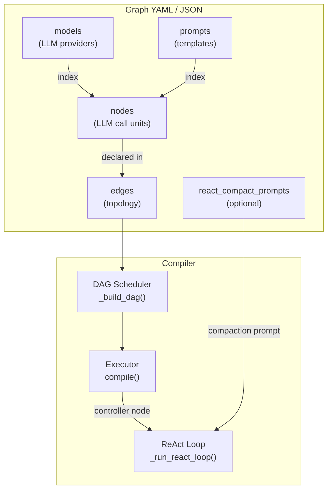
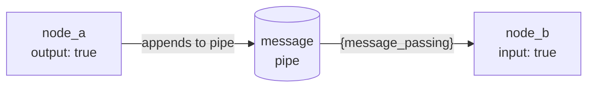
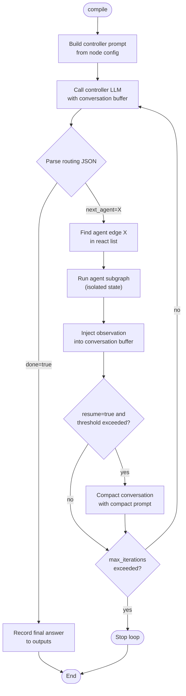
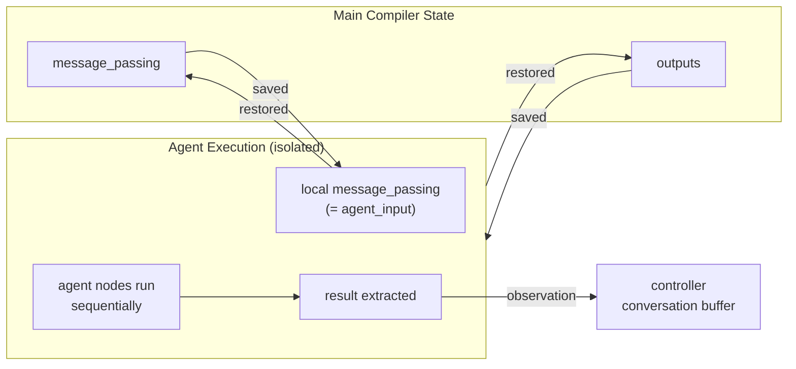
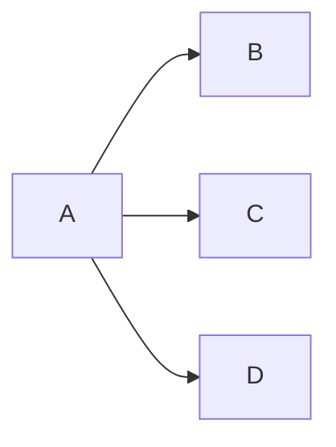
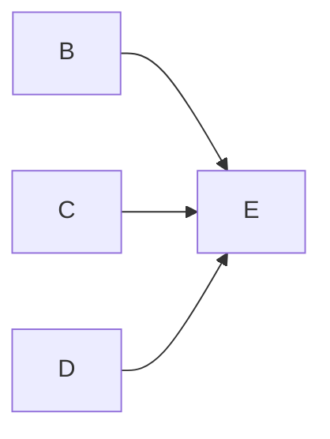
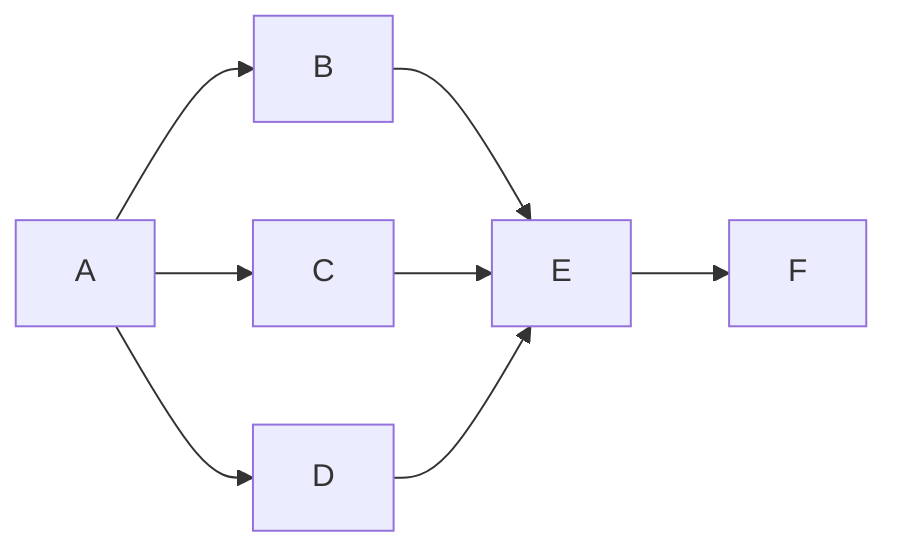
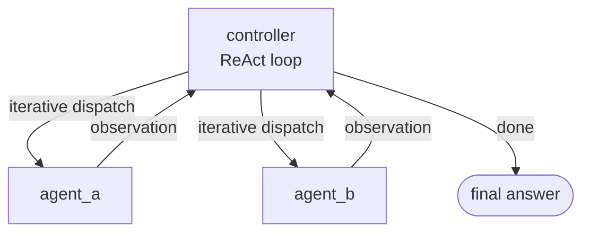
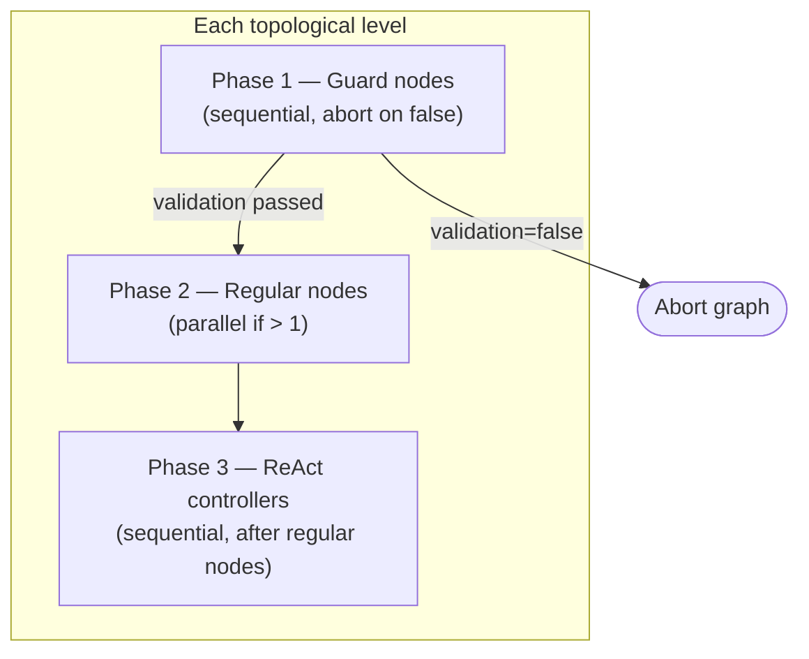

# Documentation – `Graph` Framework

Below is a detailed description of every Pydantic model that constitutes the `Graph` class hierarchy.  
For each model we list the fields, their types, optionality, and provide concrete YAML and JSON examples that represent a minimal valid instance of the model.

> **Note**: All models are importable from `kegal.graph`. Internally the graph module is split into focused sub-modules (`graph_model.py`, `graph_mcp.py`, `graph_react.py`, `graph_edge.py`, `graph_blackboard.py`, `graph_node.py`) — the public import path is unchanged.

## Table of Contents

- [Architecture overview](#architecture-overview)
- [1. `GraphModel`](#1-graphmodel)
- [2. `GraphInputData`](#2-graphinputdata)
- [3. `NodePrompt`](#3-nodeprompt)
  - [3.1 Prompt Placeholders](#31-prompt-placeholders)
- [4. `NodeMessagePassing`](#4-nodemessagepassing)
- [4.1 `ChatHistoryFile`](#41-chathistoryfile)
- [5. Blackboard models](#5-blackboard-models)
- [6. `GraphNode`](#6-graphnode)
  - [Reserved `react_output` Fields](#reserved-react_output-fields)
- [7. `NodeReact`](#7-nodereact)
- [8. `GraphEdge`](#8-graphedge)
- [9. `Graph`](#9-graph)
- [10. `LLMTool`](#10-llmtool-from-kegalllmllm_model)
- [11. `LLMStructuredSchema`](#11-llmstructuredschema-from-kegalllmllm_model)
- [12. Compiler convenience methods](#12-compiler-convenience-methods)

---

## Architecture overview



---

## 1. `GraphModel`

| Field             | Type           | Optional | Description |
|------------------|----------------|----------|-------------|
| `llm`            | `str`          | No       | Identifier of the LLM provider (e.g. `"anthropic_aws"`). |
| `model`          | `str`          | No       | Full model name or ARN (e.g. `"arn:aws:bedrock:...:claude-sonnet-4-5-20250929-v1:0"`). |
| `api_key`        | `str` \| `None`| Yes      | API key if required. |
| `host`           | `str` \| `None`| Yes      | Custom host endpoint. |
| `context_window` | `int` \| `None`| Yes      | Token context window of the model (e.g. `32768`). When set, used as the compaction threshold in the ReAct `resume` feature instead of `max_tokens`, and shown as a context-utilization percentage in markdown output. |
| `aws_region_name`| `str` \| `None`| Yes      | AWS region when using Bedrock. |
| `aws_access_key` | `str` \| `None`| Yes      | AWS access key. |
| `aws_secret_key` | `str` \| `None`| Yes      | AWS secret key. |


Provided Models
- anthropic_aws
- anthropic
- bedrock
- ollama
- openai

### YAML Example

```yaml
llm: "ollama"
model: "qwen2.5:7b"
host: "http://localhost:11434"
context_window: 32768   # optional — enables accurate resume threshold and utilization output
```


### JSON Example

```json
{
  "llm": "ollama",
  "model": "qwen2.5:7b",
  "host": "http://localhost:11434",
  "context_window": 32768
}
```


---

## 2. `GraphInputData`

| Field     | Type              | Optional | Description |
|-----------|-------------------|----------|-------------|
| `uri`     | `str` \| `None`   | Yes      | Remote or local path to a file (PDF, image, prompt template file, etc.). |
| `base64`  | `str` \| `None`   | Yes      | Base-64 encoded binary content (alternative to `uri` for images and documents). |
| `template`| `dict[str, Any]` \| `None` | Yes | Inline prompt template as a nested dict. Used in the `prompts` and `react_compact_prompts` lists as an alternative to loading a template from a `uri`. The structure is free-form; all keys are passed as-is to the prompt composer. |

*Provide at most one of `uri`, `base64`, or `template` per instance, depending on the context: `uri`/`base64` for images and documents; `uri` or `template` for prompt definitions.*

### YAML Example

```yaml
uri: "https://example.com/documents/report.pdf"
```


### JSON Example

```json
{
  "uri": "https://example.com/documents/report.pdf"
}
```


---

## 3. `NodePrompt`

| Field               | Type                     | Optional | Description |
|---------------------|--------------------------|----------|-------------|
| `template`          | `int`                    | No       | Index of the prompt template in the global `prompts` list. |
| `prompt_placeholders` | `dict[str, Any]` \| `None` | Yes      | Key/value map used to substitute placeholders in the prompt template. |
| `user_message`      | `bool` \| `None`         | Yes      | Whether to include the user’s message. |
| `retrieved_chunks`  | `bool` \| `None`         | Yes      | Whether to include retrieved document chunks. |
| `chat_history`      | `str` \| `None`          | Yes      | Named key into the top-level `chat_history` dict. When set, the corresponding list of `{role, content}` message pairs is prepended to this node’s LLM call as prior conversation turns. |


### YAML Example

```yaml
template: 1
user_message: true
retrieved_chunks: true
prompt_placeholders:
  analysis_focus: "economic benefits"
```


### JSON Example

```json
{
  "template": 1,
  "user_message": true,
  "retrieved_chunks": true,
  "prompt_placeholders": {
    "analysis_focus": "economic benefits"
  }
}
```


---

## 3.1 Prompt Placeholders

Prompt templates use Python `str.format()` syntax. The following placeholder
names are **reserved** — each is injected automatically when the corresponding
feature is enabled on the node. Using a reserved placeholder without enabling
its feature raises a `KeyError` at `compile()` time (with a descriptive
message). Custom placeholders can be added freely via `prompt_placeholders`.

`Compiler._validate_prompts()` checks all templates at construction time and
emits a `WARNING` for any placeholder that is referenced but not activated.

| Placeholder | Activated by | Content |
|---|---|---|
| `{user_message}` | `prompt.user_message: true` | The string from the top-level `user_message` YAML key or `compiler.user_message`. |
| `{message_passing}` | `message_passing.input: true` | The list of outputs written by upstream nodes with `message_passing.output: true`. |
| `{retrieved_chunks}` | `prompt.retrieved_chunks: true` | The string from the top-level `retrieved_chunks` YAML key or `compiler.retrieved_chunks`. |
| `{blackboard}` | `blackboard.read: true` | The current contents of the shared blackboard buffer at the time the node executes. |
| `{<key>}` | `prompt.prompt_placeholders: {<key>: <value>}` | The literal value from `prompt_placeholders`. Any name that does not clash with the reserved names above is safe to use. |

### Example

```yaml
prompts:
  - template:
      system_template:
        role: |
          You are an analyst specialising in {domain}.   # custom placeholder
      prompt_template:
        context: |
          Previous discussion:
          {blackboard}                                    # reserved — blackboard.read: true required
        user_input: |
          {user_message}                                  # reserved — prompt.user_message: true required

nodes:
  - id: "analyst"
    blackboard:
      id: main                                            # which board to access
      read: true
      write: true
    prompt:
      template: 0
      user_message: true
      prompt_placeholders:
        domain: "renewable energy"                        # satisfies {domain}
```

---

## 4. `NodeMessagePassing`

| Field    | Type  | Optional | Description                                        |
|----------|-------|----------|----------------------------------------------------|
| `input`  | `bool`| Yes (default `false`) | Inject the message pipe content into the node’s prompt via `{message_passing}`. |
| `output` | `bool`| Yes (default `false`) | Append this node’s response to the message pipe after execution. |

Both fields default to `false` — the entire `message_passing` block can be omitted from YAML if neither flag is set.



### YAML Example

```yaml
message_passing:
  input: false
  output: true   # this node's response is forwarded downstream
```

### JSON Example

```json
{
  "input": false,
  "output": true
}
```

---

## 4.1 `ChatHistoryFile`

`ChatHistoryFile` is used as a value in the top-level `chat_history` dict to declare a **file-based** history scope instead of an inline array. It is importable from `kegal`.

| Field  | Type   | Optional | Description |
|--------|--------|----------|-------------|
| `path` | `str`  | No       | Local file path or `https://` URL pointing to a JSON file containing a list of `{role, content}` message pairs. Local paths are resolved relative to the YAML file's directory when loading via `uri`, or relative to `cwd` when loading via `source` dict. If a local file does not exist at `Compiler` construction time, the scope starts empty. Remote URLs are fetched at construction time; only `https://` is permitted. |
| `auto` | `bool` | Yes (default `false`) | When `true`, KeGAL automatically appends a `user` turn and an `assistant` turn to the file at the end of each `compile()` call. Only valid for **local** file paths — `auto: true` with a remote URL raises `ValueError`. Inline arrays are always managed by the caller. |

### Constraints

- Each scope may be assigned to **at most one node**. Sharing a scope between two nodes raises `ValueError` at `Compiler` construction time.
- `auto: true` is only meaningful with file-based scopes. Inline array scopes are never auto-updated.

### YAML Example

```yaml
chat_history:
  # Inline scope — managed by the caller
  few_shot:
    - role: "user"
      content: "Translate 'cat' to French."
    - role: "assistant"
      content: "chat"

  # Local file scope — loaded from disk; auto-updated after each compile()
  session_a:
    path: ./history/session_a.json
    auto: true

  # Local file scope — loaded from disk; caller manages persistence
  session_b:
    path: ./history/session_b.json
    auto: false

  # Remote URL scope — fetched at Compiler init; auto: true not allowed
  shared_examples:
    path: https://example.com/history/examples.json
```

### JSON Example

```json
{
  "session_a": {
    "path": "./history/session_a.json",
    "auto": true
  }
}
```

---

## 5. Blackboard models

The **multi-board blackboard system** implements the [Blackboard architectural pattern](https://en.wikipedia.org/wiki/Blackboard_(design_pattern)): one or more named shared markdown buffers written and read across nodes during a single `compile()` run.

Three models make up the system:

| Model | Where used | Purpose |
|---|---|---|
| `GraphBlackboard` | Top-level `blackboard:` key | Declares the board set (directory path + list of boards). |
| `BlackboardEntry` | Inside `blackboard.boards` | Describes a single board file, its cleanup behaviour, and its import chain. |
| `NodeBlackboardRef` | `GraphNode.blackboard` | References a board by ID and declares whether the node reads and/or writes it. |

---

### `GraphBlackboard`

| Field | Type | Optional | Description |
|---|---|---|---|
| `path` | `str` | No | Directory where board files are stored. Resolved relative to the YAML file's directory when loading via `uri`; relative to the current working directory when loading via `source` dict. |
| `boards` | `list[BlackboardEntry]` | No | Ordered list of board definitions. Board IDs must be unique. |

### `BlackboardEntry`

| Field | Type | Optional | Description |
|---|---|---|---|
| `id` | `str` | No | Unique name for this board. Referenced in `NodeBlackboardRef.id` and `import` chains. |
| `file` | `str` | No | Filename inside `path` (e.g. `BLACKBOARD.md`). |
| `cleanup` | `bool` | Yes (default `true`) | When `true`, the file is truncated to empty at `Compiler` construction time. When `false`, existing content is preserved and new writes are appended. |
| `import` | `list[str]` | Yes (default `[]`) | List of board IDs whose current content is **prepended** to this board's content when it is read by a node. Boards are prepended in declaration order. |

> **`import`** is a Python reserved word. In YAML/JSON it is written as `import:`. Internally it is stored as `imports` on the `BlackboardEntry` object.

### `NodeBlackboardRef`

| Field | Type | Optional | Description |
|---|---|---|---|
| `id` | `str` | No | ID of the board this node reads from / writes to. Must match a `BlackboardEntry.id` declared in `Graph.blackboard.boards`. |
| `read` | `bool` | Yes (default `false`) | Inject the current board content (including imported boards, in declaration order) into the node's prompt via the `{blackboard}` placeholder. |
| `write` | `bool` | Yes (default `false`) | Append the node's LLM response to this board after execution. The updated content is written back to disk immediately after each write. |

### Node categories

Three behaviour patterns emerge from the `read`/`write` combination:

| Category | `read` | `write` | Role |
|----------|--------|---------|------|
| Cat-1 | `false` | `true`  | **Writer** — seeds the board (e.g. an assistant that drafts the initial content). |
| Cat-2 | `true`  | `true`  | **Enricher** — reads then extends the board (e.g. domain analysts). Multiple Cat-2 nodes run in parallel. |
| Cat-3 | `true`  | `false` | **Reader** — consumes the final board (e.g. a summarizer). |

The compiler infers the correct execution order automatically from these categories even when the `edges` list is flat (no `children`/`fan_in` declarations). Cat-1 nodes run first, Cat-2 nodes in parallel after all Cat-1 nodes complete, and Cat-3 nodes after all Cat-2 nodes complete.

### Import chains

When a board declares `import: [other_id]`, the content of `other_id` is prepended to this board's content at read time. Multiple imports are concatenated in declaration order before the board's own content.

### YAML Example

```yaml
blackboard:
  path: ./                      # resolved relative to the YAML file's dir (or cwd when using source dict)
  boards:
    - id: main
      file: BLACKBOARD.md
      cleanup: true             # truncate at init (default)
    - id: summary
      file: SUMMARY.md
      cleanup: false            # keep existing content
      import: [main]            # prepend main board when summary is read

nodes:
  - id: "assistant"
    blackboard:
      id: main
      read: false
      write: true               # Cat-1: seeds the main board
    prompt:
      template: 0
      user_message: true

  - id: "analyst"
    blackboard:
      id: main
      read: true
      write: true               # Cat-2: enriches the main board
    prompt:
      template: 1               # template uses {blackboard}

  - id: "summarizer"
    blackboard:
      id: summary
      read: true                # reads main (via import) + summary's own content
      write: false              # Cat-3: consumes the final state
    prompt:
      template: 2               # template uses {blackboard}
```

The `{blackboard}` placeholder in a prompt template is automatically injected
when `blackboard.read: true` is set on the node. No additional `prompt_placeholders`
entry is needed.

### JSON Example (`NodeBlackboardRef`)

```json
{
  "id": "main",
  "read": true,
  "write": false
}
```

### JSON Example (`GraphBlackboard`)

```json
{
  "path": "./",
  "boards": [
    { "id": "main", "file": "BLACKBOARD.md", "cleanup": true }
  ]
}
```

---

## 6. `GraphNode`

| Field               | Type                         | Optional | Description |
|---------------------|------------------------------|----------|-------------|
| `id`                | `str`                        | No       | Unique identifier of the node. |
| `model`             | `int`                        | No       | Index of the model in the global `models` list. |
| `temperature`       | `float`                      | No       | Sampling temperature for the LLM. |
| `max_tokens`        | `int`                        | No       | Maximum token length for the LLM response. |
| `show`              | `bool`                       | No       | Display hint for `save_outputs_as_markdown()`. When `false`, the node is still executed and included in `get_outputs()`, but omitted from the markdown report. |
| `message_passing`   | `NodeMessagePassing`         | Yes (default `{input: false, output: false}`) | Configuration of input/output passing. |
| `blackboard`        | `NodeBlackboardRef` \| `None` | Yes     | References a named board by `id` and declares read/write participation. See §5 Blackboard models. |
| `prompt`            | `NodePrompt` \| `None`       | Yes      | Prompt configuration. |
| `structured_output` | `dict[str, Any]` \| `None`   | Yes      | JSON schema for the node’s structured output (guard nodes, data extraction). |
| `react_output`      | `dict[str, Any]` \| `None`   | Yes      | JSON schema for the routing output of a ReAct controller. The LLM must return a response conforming to this schema on every iteration. The compiler reads five reserved fields from it — see [Reserved `react_output` Fields](#reserved-react_output-fields) below. |
| `react`             | `NodeReact` \| `None`        | Yes      | ReAct loop config. When set, the node acts as a controller that iteratively dispatches to agents. See §7 `NodeReact`. |
| `images`            | `list[int]` \| `None`        | Yes      | Indices of images to be provided to the node. |
| `documents`         | `list[int]` \| `None`        | Yes      | Indices of documents to be provided to the node. |
| `tools`             | `list[str]` \| `None`        | Yes      | Names of tools (matching the `name` field in the top-level `tools` list) available to this node. |
| `mcp_servers`       | `list[str]` \| `None`        | Yes      | IDs of MCP servers (matching the `id` field in the top-level `mcp_servers` list) available to this node. |

> **Index validation**: `model` and `prompt.template` are validated at `Compiler` construction time. If either index is out of range, a `ValueError` listing all offending nodes is raised before the first `compile()` call.

### Reserved `react_output` Fields

When a node has a `react` block (i.e. it is a ReAct controller), the compiler reads the following fields from its structured output on every iteration. Declare them in `react_output.parameters` and include the mandatory ones in `react_output.required`.

| Field | Type | Required | Meaning |
|---|---|---|---|
| `reasoning` | `str` | Recommended | The controller's chain-of-thought for this step. Logged in the ReAct trace for debugging but **not** sent back to the controller as an observation. |
| `done` | `bool` | Yes | `true` signals the loop to stop. When `true`, `next_agent` and `agent_input` are ignored and `final_answer` is expected. |
| `next_agent` | `str` | When `done` is `false` | ID of the agent node to dispatch this iteration. Must match a node declared in the edge's `react` list. |
| `agent_input` | `str` | When `done` is `false` | Instruction or question to send to the chosen agent. If the agent node has `message_passing.input: true`, this value is injected into its prompt via `{message_passing}`. |
| `final_answer` | `str` | When `done` is `true` | The controller's synthesized answer after all reasoning steps. Recorded in `CompiledNodeOutput`. If the controller has `message_passing.output: true`, this value is also pushed to the shared message pipe for downstream nodes. |

#### Minimal `react_output` schema

```yaml
react_output:
  description: "Routing decision for the ReAct controller"
  parameters:
    reasoning:
      type: "string"
      description: "Step-by-step thinking before deciding what to do next."
    done:
      type: "boolean"
      description: "Set to true when the task is complete and no further dispatch is needed."
    next_agent:
      type: "string"
      description: "ID of the agent to dispatch. Omit when done is true."
    agent_input:
      type: "string"
      description: "Task or question to send to the selected agent. Omit when done is true."
    final_answer:
      type: "string"
      description: "Synthesized final answer. Populate only when done is true."
  required:
    - "reasoning"
    - "done"
```

### YAML Example

```yaml
id: "test_rag_node"
model: 0
temperature: 0.7
max_tokens: 1000
show: true
message_passing:
  input: false
  output: false
prompt:
  template: 1
  user_message: true
  retrieved_chunks: true
  prompt_placeholders:
    analysis_focus: "economic benefits"
structured_output:
  description: "Renewable energy analysis summary"
  parameters:
    validation:
      type: "boolean"
      description: "Whether the message is consistent with the context or not"
    cost_metrics:
      type: "object"
      description: "Cost analysis"
    growth_rate:
      type: "number"
      description: "Annual growth percentage"
    recommendation:
      type: "string"
      description: "Key recommendation"
      enum: ["invest", "wait", "diversify"]
  required:
    - validation
    - cost_metrics
    - growth_rate
    - recommendation
```


### JSON Example

```json
{
  "id": "test_rag_node",
  "model": 0,
  "temperature": 0.7,
  "max_tokens": 1000,
  "show": true,
  "message_passing": {
    "input": false,
    "output": false
  },
  "prompt": {
    "template": 1,
    "user_message": true,
    "retrieved_chunks": true,
    "prompt_placeholders": {
      "analysis_focus": "economic benefits"
    }
  },
  "structured_output": {
    "description": "Renewable energy analysis summary",
    "parameters": {
      "validation": {
        "type": "boolean",
        "description": "Whether the message is consistent with the context or not"
      },
      "cost_metrics": {
        "type": "object",
        "description": "Cost analysis"
      },
      "growth_rate": {
        "type": "number",
        "description": "Annual growth percentage"
      },
      "recommendation": {
        "type": "string",
        "description": "Key recommendation",
        "enum": ["invest", "wait", "diversify"]
      }
    },
    "required": [
      "validation",
      "cost_metrics",
      "growth_rate",
      "recommendation"
    ]
  }
}
```


### Reserved Structured Output Field: `validation`

When a node defines a `structured_output` schema that includes a **`validation`** field of type `boolean`, the compiler treats it as a **gate**. After the node is executed:

- If `validation` is `true` (or the field is absent), compilation continues normally to the next edge or child node.
- If `validation` is `false`, compilation **stops immediately** and no further nodes are executed.

This mechanism is designed for **guard nodes** — nodes whose purpose is to check the user message before the main workflow runs. Typical use cases include:

- **Content moderation**: reject inappropriate or toxic messages.
- **Prompt injection prevention**: detect and block adversarial inputs.
- **Input quality checks**: ensure the user message meets minimum requirements.

#### Example: Guard Node

```yaml
- id: "language_check"
  model: 0
  temperature: 0.3
  max_tokens: 500
  show: true
  message_passing:
    input: false
    output: false
  prompt:
    template: 0
    user_message: true
    retrieved_chunks: false
  structured_output:
    description: "Language appropriateness assessment"
    parameters:
      validation:
        type: "boolean"
        description: "Whether message is appropriate for business use"
      action:
        type: "string"
        description: "Action recommendation"
        enum: ["approve", "reject"]
    required: ["validation", "action"]
```

In this example, if the LLM determines the message is inappropriate, it returns `validation: false` and the graph execution halts before any downstream nodes are reached.

> **Note**: The `validation` field is entirely optional. Nodes without it in their structured output will always allow compilation to proceed.

> **Requirement**: A guard node (one with `validation` in its `structured_output`) **must** have a `prompt` block. Omitting `prompt` on a guard node raises `ValueError` at `compile()` time rather than silently passing the gate.

---

## 7. `NodeReact`

Configuration block for a **ReAct controller** node. Placed inside `GraphNode.react`.

| Field               | Type    | Optional | Default | Description |
|---------------------|---------|----------|---------|-------------|
| `max_iterations`    | `int`   | Yes      | `10`    | Maximum number of agent dispatches before the loop is force-stopped. |
| `resume`            | `bool`  | Yes      | `false` | When `true`, automatically compacts the conversation buffer when it approaches the context limit. |
| `resume_threshold`  | `float` | Yes      | `0.8`   | Fraction of the model's `context_window` (or `max_tokens` if `context_window` is not set) at which compaction is triggered. Only relevant when `resume: true`. |

### ReAct execution loop



### Agent subgraph isolation



### YAML Example

```yaml
react:
  max_iterations: 8
  resume: true
  resume_threshold: 0.75
```

### Controller vs agent feature support

The controller and agent nodes have different execution paths and therefore support different feature sets.

| Feature | Controller | Agent nodes |
|---|---|---|
| `tools` | ✗ ignored — warning at init | ✓ full tool loop |
| `mcp_servers` | ✗ ignored — warning at init | ✓ full tool loop |
| `blackboard.read` / `.write` | ✗ ignored — warning at init | ✓ writes persist globally across iterations |
| `message_passing.input` | ✓ seeds the initial conversation message | ✓ receives `agent_input` from controller |
| `message_passing.output` | ✓ pushes `final_answer` to the shared buffer | ✓ result observed by controller |
| `images` / `documents` | ✓ included in every controller LLM call | ✓ standard behaviour |
| `structured_output` | — overridden by `react_output` | ✓ standard behaviour |
| `chat_history` | ✓ seeds the conversation buffer | ✓ standard behaviour |
| `user_message` | ✓ first user turn in the conversation | ✓ standard behaviour |

**Why tools and MCP are excluded from the controller:** the controller LLM call must return a routing JSON (`react_output`). Mixing a tool loop inside that conversation would create ambiguity — the model cannot simultaneously return routing JSON and invoke tools. If the controller needs to look something up, dispatch a dedicated agent node that has the tool assigned.

---

## 8. `GraphEdge`

| Field      | Type                       | Optional | Description |
|------------|----------------------------|----------|-------------|
| `node`     | `str`                      | No       | Unique identifier of the node this edge entry describes. |
| `children` | `list[GraphEdge]` \| `None`| Yes      | **Fan-out**: nodes to launch in parallel when this node completes. Each entry is itself a `GraphEdge`, allowing recursive sub-structure at any depth. |
| `fan_in`   | `list[GraphEdge]` \| `None`| Yes      | **Aggregation**: nodes this node waits for before starting. This node will not execute until every node listed here has completed. |
| `react`    | `list[GraphEdge]` \| `None`| Yes      | **ReAct agent list**: nodes available to the controller for iterative dispatch. Each entry is a `GraphEdge` (with optional `children`/`fan_in` for multi-step agent subgraphs). Mutually exclusive with `children` and `fan_in`. |

> **Mutual exclusivity**: `react` cannot be combined with `children` or `fan_in` on the same edge entry. `react` + `children` raises a `ValidationError` at parse time; `react` + `fan_in` raises a `ValueError` at `Compiler` construction. Use `message_passing` to order the controller relative to other nodes — the inference stage handles scheduling automatically.

### Dependency semantics

**`edges` describe execution order only** — which node must complete before another can start. Data exchange between nodes is controlled independently by `message_passing` (`input`/`output`) on the nodes themselves.

**Three dependency patterns:**

- `children` (fan-out): node A completes → children B, C, D start in parallel.
- `fan_in` (aggregation): node E starts only when all nodes listed in its `fan_in` have completed.
- `react` (ReAct dispatch): controller C iteratively calls agents from its `react` list until it signals `done: true`.

### Topology diagrams

#### Fan-out



#### Fan-in



#### Fan-out + fan-in



#### ReAct controller



**Guard nodes** (nodes whose `structured_output` contains a `validation` boolean field) automatically precede all other nodes regardless of edge declarations.

**`message_passing` inference**: if no edges are declared, a node with `output: true` automatically becomes a dependency of any later node with `input: true`, based on their declaration order in the `nodes` list.

### YAML Examples

#### Linear pipeline — no edges required

Two nodes exchanging data via `message_passing` need no edge declarations.
```yaml
nodes:
  - id: "preprocessor"
    message_passing: {input: false, output: true}
    ...
  - id: "analyzer"
    message_passing: {input: true, output: false}
    ...
# edges: omitted — message_passing inference handles ordering
```

#### Fan-out: task decomposition

```yaml
# A completes, then B, C, D run in parallel
edges:
  - node: "A"
    children:
      - node: "B"
      - node: "C"
      - node: "D"
```

#### Fan-in: aggregation

```yaml
# E starts only when B, C, D have all completed
edges:
  - node: "E"
    fan_in:
      - node: "B"
      - node: "C"
      - node: "D"
```

#### Fan-out + fan-in combined

```yaml
# A launches B, C, D in parallel; E waits for all three; E then launches F
edges:
  - node: "A"
    children:
      - node: "B"
      - node: "C"
      - node: "D"
  - node: "E"
    fan_in:
      - node: "B"
      - node: "C"
      - node: "D"
    children:
      - node: "F"
```

> **Note**: B, C, D appear twice — once as `children` of A (who launches them) and once in `fan_in` of E (who waits for them). This is correct and intentional; the two declarations describe different relationships.

#### Nested structure

```yaml
# E waits for B; B itself launches sub-tasks X and Y (fan-out from B)
edges:
  - node: "E"
    fan_in:
      - node: "B"
        children:
          - node: "X"
          - node: "Y"
      - node: "C"
```

> **Note**: `children` always means fan-out (B launches X and Y after B completes). E depends only on B, not on X or Y. If E must also wait for X and Y, declare them explicitly in `fan_in`.

#### ReAct controller with two agents

```yaml
edges:
  - node: "controller"
    react:
      - node: "math_agent"
      - node: "knowledge_agent"
```

The `controller` node runs the ReAct loop; `math_agent` and `knowledge_agent` are **excluded from the main DAG** and only run when the controller dispatches to them.

#### ReAct agent with internal fan-out

```yaml
edges:
  - node: "controller"
    react:
      - node: "research_agent"
        children:
          - node: "web_search"
          - node: "db_lookup"
```

Agent subgraphs can use `children` and `fan_in` internally to structure their own execution.

### JSON Example

```json
{
  "node": "A",
  "children": [
    { "node": "B" },
    { "node": "C" }
  ]
}
```

---

## 9. `Graph`

| Field                   | Type                                   | Optional | Description |
|-------------------------|----------------------------------------|----------|-------------|
| `models`                | `list[GraphModel]`                     | No       | List of LLM configurations. |
| `images`                | `list[GraphInputData]` \| `None`       | Yes      | Image sources used in the graph. |
| `documents`             | `list[GraphInputData]` \| `None`       | Yes      | Document sources used in the graph. |
| `tools`                 | `list[LLMTool]` \| `None`              | Yes      | Tool definitions (from `kegal.llm.llm_model`). Each tool is referenced by its `name` in `GraphNode.tools`. |
| `mcp_servers`           | `list[GraphMcpServer]` \| `None`       | Yes      | MCP server configurations. Each server is referenced by its `id` in `GraphNode.mcp_servers`. |
| `prompts`               | `list[GraphInputData]`                 | No       | Prompt templates (indexed by `NodePrompt.template`). |
| `react_compact_prompts` | `list[GraphInputData]` \| `None`       | Yes      | Custom prompts used to summarize the ReAct conversation buffer when `resume: true` triggers compaction. Accepts `uri` or inline `template` exactly like regular `prompts`. Index 0 overrides the built-in default compaction prompt. |
| `chat_history`          | `dict[str, list[dict[str, str]] \| ChatHistoryFile]` \| `None` | Yes | Conversation history as a dict mapping scope names to either an inline list of `{role, content}` message pairs or a `ChatHistoryFile` (external JSON file). A node references its history by name via `NodePrompt.chat_history`. Each scope may be assigned to at most one node — sharing a scope between two nodes raises `ValueError` at `Compiler` construction time. |
| `user_message`          | `str` \| `None`                        | Yes      | Current user prompt. |
| `retrieved_chunks`      | `str` \| `None`                        | Yes      | Additional retrieved content (e.g., document snippets). |
| `blackboard`            | `GraphBlackboard` \| `None`            | Yes      | Multi-board blackboard configuration: directory path and list of named board files. See §5 Blackboard models. |
| `nodes`                 | `list[GraphNode]`                      | No       | All nodes in the graph. |
| `edges`                 | `list[GraphEdge]`                      | No       | Graph topology. |


### DAG execution phases per topological level



### YAML Example (trimmed to essential fields)

```yaml
models:
  - llm: ""
    model: ""
    aws_region_name: ""
    aws_access_key: ""
    aws_secret_key: ""

prompts:
  - template:
      system_template:
        role_and_capabilities: |
          You are a content moderation specialist focused on language appropriateness.
          You evaluate messages for professionalism, toxicity, and business suitability.
        behavioral_guidelines: |
          - Assess language tone and professionalism
          - Detect inappropriate content or toxicity
          - Provide clear approval/rejection decisions
      prompt_template:
        context: |
          Evaluate the user message for appropriateness in business context.
        instruction: |
          Analyze this message: "{user_message}"
          Determine if it's appropriate for business communication.

nodes:
  - id: "language_check"
    model: 0
    temperature: 0.3
    max_tokens: 500
    show: true
    message_passing:
      input: false
      output: false
    prompt:
      template: 0
      user_message: true
      retrieved_chunks: false
    structured_output:
      description: "Language appropriateness assessment"
      parameters:
        validation:
          type: "boolean"
          description: "Whether message is appropriate for business use"
        action:
          type: "string"
          description: "Action recommendation"
          enum: [ "approve",  "reject" ]
      required: [ "validation", "action"]

edges:
  - node: "language_check"
```


### JSON Example (minimal)

```json
{
  "models": [
    {
      "llm": "",
      "model": "",
      "aws_region_name": "",
      "aws_access_key": "",
      "aws_secret_key": ""
    }
  ],
  "prompts": [
    {
      "template": {
        "system_template": {
          "role_and_capabilities": "You are a content moderation specialist focused on language appropriateness.\nYou evaluate messages for professionalism, toxicity, and business suitability.",
          "behavioral_guidelines": "- Assess language tone and professionalism\n- Detect inappropriate content or toxicity\n- Provide clear approval/rejection decisions"
        },
        "prompt_template": {
          "context": "Evaluate the user message for appropriateness in business context.",
          "instruction": "Analyze this message: \"{user_message}\"\nDetermine if it's appropriate for business communication."
        }
      }
    }
  ],
  "nodes": [
    {
      "id": "language_check",
      "model": 0,
      "temperature": 0.3,
      "max_tokens": 500,
      "show": true,
      "message_passing": {
        "input": false,
        "output": false
      },
      "prompt": {
        "template": 0,
        "user_message": true,
        "retrieved_chunks": false
      },
      "structured_output": {
        "description": "Language appropriateness assessment",
        "parameters": {
          "validation": {
            "type": "boolean",
            "description": "Whether message is appropriate for business use"
          },
          "action": {
            "type": "string",
            "description": "Action recommendation",
            "enum": ["approve", "reject"]
          }
        },
        "required": ["validation", "action"]
      }
    }
  ],
  "edges": [
    {
      "node": "language_check"
    }
  ]
}
```


---

## 10. `LLMTool` (from `kegal.llm.llm_model`)

| Field        | Type                                   | Optional | Description |
|--------------|-----------------------------------------|----------|-------------|
| `name`       | `str`                                  | No       | Name of the tool. |
| `description`| `str`                                  | No       | Short description of what the tool does. |
| `parameters` | `dict[str, LLMStructuredSchema]`       | No       | JSON-schema-style parameter definitions. |
| `required`   | `list[str]`                            | No       | List of required parameter names. |


> **Tip**: Use this model when you need to pass structured function‑call capabilities to the LLM.

### YAML Example

```yaml
tools:
  - name: "search_kb"
    description: "Search the knowledge base for relevant content."
    parameters:
      query:
        type: "string"
        description: "The search query string."
    required:
      - "query"
```

### JSON Example

```json
{
  "name": "search_kb",
  "description": "Search the knowledge base for relevant content.",
  "parameters": {
    "query": {
      "type": "string",
      "description": "The search query string."
    }
  },
  "required": ["query"]
}
```

## 11. `LLMStructuredSchema` (from `kegal.llm.llm_model`)

| Field         | Type                       | Optional | Description |
|---------------|----------------------------|----------|-------------|
| `schema_`     | `str`                      | Yes      | JSON‑schema identifier (`$schema`). |
| `id_`         | `str`                      | Yes      | Unique schema ID (`$id`). |
| `ref`         | `str`                      | Yes      | Reference to another schema (`$ref`). |
| `defs`        | `dict[str, Any]`           | Yes      | Definitions for reusable subschemas (`$defs`). |
| `comment`     | `str`                      | Yes      | Comment for documentation (`$comment`). |
| `type`        | `str` or `list[str]`      | Yes      | JSON‑schema type(s). |
| `enum`        | `list[Any]` or `None`     | Yes      | Allowed literal values. |
| `const`       | `Any`                      | Yes      | Single allowed value. |
| `title`       | `str`                      | Yes      | Short title for the schema. |
| `description` | `str` or `None`           | Yes      | Detailed description. |
| `default`     | `Any`                      | Yes      | Default value if none provided. |
| `examples`    | `list[Any]` or `None`     | Yes      | Example values. |
| `deprecated`  | `bool` or `None`           | Yes      | Flag indicating deprecation. |
| `multipleOf`  | `float` or `int` or `None`| Yes      | For numeric types: multiple constraint. |
| `minimum`     | `float` or `int` or `None`| Yes      | Minimum inclusive value. |
| `maximum`     | `float` or `int` or `None`| Yes      | Maximum inclusive value. |
| `exclusiveMinimum` | `float` or `int` or `None` | Yes | Minimum exclusive value. |
| `exclusiveMaximum` | `float` or `int` or `None` | Yes | Maximum exclusive value. |
| `minLength`   | `int` or `None`           | Yes      | Minimum string length. |
| `maxLength`   | `int` or `None`           | Yes      | Maximum string length. |
| `pattern`     | `str` or `None`           | Yes      | Regex pattern for strings. |
| `format`      | `str` or `None`           | Yes      | String format hint (e.g., `date-time`). |
| `prefixItems` | `list[dict[str, Any]]` or `None` | Yes | Array items schema for each position. |
| `minItems`    | `int` or `None`           | Yes      | Minimum number of array items. |
| `maxItems`    | `int` or `None`           | Yes      | Maximum number of array items. |
| `uniqueItems` | `bool` or `None`          | Yes      | Whether array items must be unique. |
| `contains`    | `dict[str, Any]` or `None` | Yes      | Subschema that array must contain. |
| `items`       | `dict[str, Any]` or `bool` or `None` | Yes | Schema for array elements or boolean for all items. |
| `patternProperties` | `dict[str, Any]` or `None` | Yes | Regex pattern keys for object properties. |
| `additionalProperties` | `dict[str, Any]` or `bool` or `None` | Yes | Schema for unspecified object properties. |
| `minProperties` | `int` or `None`         | Yes      | Minimum number of object properties. |
| `maxProperties` | `int` or `None`         | Yes      | Maximum number of object properties. |
| `dependentRequired` | `dict[str, list[str]]` or `None` | Yes | Required properties depending on other properties. |
| `properties`  | `dict[str, Any]` or `None` | Yes | Nested field schemas for objects. |
| `required`    | `list[str]` or `None`    | Yes      | Required properties for objects. |
| `allOf`       | `list[dict[str, Any]]` or `None` | Yes | List of subschemas all must validate. |
| `anyOf`       | `list[dict[str, Any]]` or `None` | Yes | List of subschemas at least one must validate. |
| `oneOf`       | `list[dict[str, Any]]` or `None` | Yes | List of subschemas exactly one must validate. |
| `not_`        | `dict[str, Any]` or `None` | Yes | Schema that must not validate. |
| `if_`         | `dict[str, Any]` or `None` | Yes | Conditional schema if condition holds. |
| `then`        | `dict[str, Any]` or `None` | Yes | Schema to validate if `if_` holds. |
| `else_`       | `dict[str, Any]` or `None` | Yes | Schema to validate if `if_` does not hold. |
| `dependentSchemas` | `dict[str, dict[str, Any]]` or `None` | Yes | Schema depending on property presence. |
| `model_config` | `dict` or `None`        | Yes      | Pydantic model configuration (e.g., `{"extra": "allow"}`). |

This model is used inside `LLMTool.parameters` and `structured_output.parameters` / `react_output.parameters` on `GraphNode` to describe each field of a schema the LLM should return.

### YAML Example (String with enum)

```yaml
type: "string"
enum:
  - "approve"
  - "reject"
description: "Whether the message is appropriate for business use."
```

### JSON Example (String with enum)

```json
{
  "type": "string",
  "enum": ["approve", "reject"],
  "description": "Whether the message is appropriate for business use."
}
```

### YAML Example (Object)

```yaml
type: "object"
description: "User profile information"
properties:
  name:
    type: "string"
    description: "User's full name"
  age:
    type: "integer"
    description: "User's age in years"
  status:
    type: "string"
    enum: ["active", "inactive", "pending"]
    description: "Account status"
required:
  - "name"
  - "status"
```

### JSON Example (Array)

```json
{
  "type": "array",
  "description": "List of approved categories",
  "items": {
    "type": "string",
    "enum": ["technology", "business", "education"]
  }
}
```

---

## 12. Compiler convenience methods

Two helper methods on `Compiler` load external content into the mutable
`retrieved_chunks` and `chat_history` attributes before calling `compile()`.
Each method accepts exactly one source argument; passing zero or more than one
raises `ValueError`.

---

### `add_retrieved_chunks(*, file, uri, chunks)`

Sets `compiler.retrieved_chunks` to the text content of the given source.

| Argument | Type            | Description |
|----------|-----------------|-------------|
| `file`   | `Path \| None`  | Local file read as UTF-8 text. |
| `uri`    | `str \| None`   | `https://` URL to fetch; only HTTPS is permitted. |
| `chunks` | `str \| None`   | Plain text string used as-is. |

```python
from pathlib import Path
from kegal import Compiler

with Compiler(uri="path/to/graph.yml") as compiler:
    compiler.add_retrieved_chunks(file=Path("context.txt"))
    compiler.user_message = "What does the document say?"
    compiler.compile()
```

---

### `add_chat_history(id, *, file, uri, history)`

Sets `compiler.chat_history[id]` to the history loaded from the given source.

| Argument  | Type           | Description |
|-----------|----------------|-------------|
| `id`      | `str`          | Scope key (positional). Must match a scope declared in the graph's `chat_history` dict or referenced by `NodePrompt.chat_history` on a node. |
| `file`    | `Path \| None` | Local JSON file containing a list of `{role, content}` dicts. |
| `uri`     | `str \| None`  | `https://` URL returning the same JSON; only HTTPS is permitted. |
| `history` | `list \| None` | Inline list of `{role, content}` dicts; a copy is stored. |

```python
from pathlib import Path
from kegal import Compiler

with Compiler(uri="path/to/graph.yml") as compiler:
    compiler.add_chat_history("session_a", file=Path("history/session_a.json"))
    compiler.user_message = "Follow-up question"
    compiler.compile()
```


