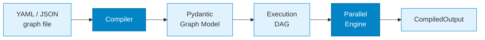

---
hide:
  - toc
---

# KeGAL — Kedos Graph Agent for LLM

KeGAL is a graph-based agent orchestration framework for LLMs. You describe the entire pipeline (nodes, edges, prompts, models, and tools) in a single YAML or JSON file. KeGAL compiles the definition into a validated, typed graph and executes it, scheduling nodes in parallel wherever the topology allows.

Each node is an LLM call. Edges define execution order and data flow. Fan-out branches spawn in parallel; fan-in waits for all of them before the next node runs. Blackboard buffers let nodes share structured context without explicit message chains. ReAct controller loops drive iterative reason-and-act cycles with automatic context-window compaction.

Topology is not a routing convenience: it is the primary design lever. KeGAL is built around a rigorous formal model in which the graph structure itself carries coordination guarantees.

=== "Install"

    ```bash
    pip install "kegal[anthropic]"   # Anthropic
    pip install "kegal[openai]"      # OpenAI
    pip install "kegal[gemini]"      # Google Gemini
    pip install "kegal[ollama]"      # Ollama (local)
    pip install "kegal[all]"         # all providers
    ```

=== "Quick start"

    ```python
    from kegal import Compiler

    with Compiler(uri="my_graph.yml") as compiler:
        compiler.user_message = "Analyse this document."
        compiler.compile()
        outputs = compiler.get_outputs()
    ```

=== "Minimal graph"

    ```yaml
    models:
      - llm: "anthropic"
        model: "claude-sonnet-4-6"
        api_key: "${ANTHROPIC_API_KEY}"

    prompts:
      - template:
          system_template:
            role: "You are a concise summariser."
          prompt_template:
            text: "{user_message}"

    nodes:
      - id: "summariser"
        model: 0
        prompt: { template: 0, user_message: true }

    edges:
      - node: "summariser"
    ```

---

## How it works



A single YAML file fully specifies the graph (nodes, edges, prompts, models, tools, and blackboards).
`Compiler` validates the schema, resolves topology, and drives the parallel execution engine.

---

## Execution Patterns

=== "Static DAG"

    Each node is an LLM call. Edges define execution order. **Fan-out** spawns parallel branches;
    **fan-in** waits for all of them before the next node runs.
    A **blackboard** lets any writer contribute to a shared buffer that any downstream reader can consume.

    ```mermaid
    flowchart TD
        IN([user_message]) --> A["analyst"]
        A -->|fan-out| B["branch_1"]
        A -->|fan-out| C["branch_2"]
        B -. write .-> BB[("blackboard")]
        C -. write .-> BB
        BB -. read .-> D
        B -->|fan-in| D["synthesizer"]
        C -->|fan-in| D
        D --> OUT([output])

        style BB  fill:#fef9c3,stroke:#ca8a04
        style IN  fill:#dcfce7,stroke:#16a34a
        style OUT fill:#dcfce7,stroke:#16a34a
    ```

=== "Dynamic ReAct Loop"

    A **controller** node drives an iterative reason-and-act cycle.
    At each iteration it dispatches tasks to one or more **agent** nodes, which call external tools
    and return observations. The loop continues until the controller converges on a final answer.

    ```mermaid
    flowchart TD
        IN([user_message]) --> CTL["controller"]
        CTL -->|dispatch task| AGT["agent"]
        AGT -->|call| T1["tool / API"]
        AGT -->|call| T2["tool / API"]
        T1 -->|result| AGT
        T2 -->|result| AGT
        AGT -->|observation| CTL
        CTL -->|iterate| CTL
        CTL -->|converged| OUT([output])

        style CTL fill:#ede9fe,stroke:#7c3aed
        style AGT fill:#fce7f3,stroke:#db2777
        style IN  fill:#dcfce7,stroke:#16a34a
        style OUT fill:#dcfce7,stroke:#16a34a
    ```

=== "Blackboard"

    Multiple writer nodes each contribute a section to a shared markdown buffer.
    A downstream reader receives the entire buffer as prompt context,
    enabling structured synthesis without message-passing chains.

    ```mermaid
    flowchart TD
        BB[("blackboard\nbuffer")]
        W1["writer_1"] -. "write §A" .-> BB
        W2["writer_2"] -. "write §B" .-> BB
        W3["writer_3"] -. "write §C" .-> BB
        BB -->|full context| R["reader / synthesizer"]
        R --> OUT([output])

        style BB  fill:#fef9c3,stroke:#ca8a04
        style OUT fill:#dcfce7,stroke:#16a34a
    ```

---

## Features

<div class="grid cards" markdown>

-   :material-graph-outline: **Fan-out / Fan-in**

    ---

    Parallel branches with aggregation. Recursive, composable, and ordering-aware via `ordered_children` and `ordered_fan_in`.

-   :material-database-outline: **Multi-board Blackboard**

    ---

    Shared markdown buffers written and read across nodes. Multiple independent boards per graph.

-   :material-rotate-right: **ReAct Loop**

    ---

    Iterative reason-and-act controllers with automatic context-window compaction and per-iteration traces.

-   :material-code-json: **Structured Output**

    ---

    Enforce JSON schemas on LLM responses. Validated against OpenAI and Anthropic tool schemas at load time.

-   :material-shield-check-outline: **Guard Nodes**

    ---

    Validation nodes abort the graph early on `validation: false`, before wasting tokens downstream.

-   :material-swap-horizontal: **Multi-Provider**

    ---

    Mix Anthropic, OpenAI, Ollama, AWS Bedrock, and Google Gemini in one graph. Different model per node.

-   :material-server-network: **MCP Support**

    ---

    Connect to external tool servers via stdio or SSE. Tools exposed automatically as LLM function calls.

-   :material-function-variant: **Python Tool Executors**

    ---

    Attach plain Python callables as tools (no server, no protocol, just a function).

-   :material-counter: **Context Window Tracking**

    ---

    Accurate compaction thresholds and per-node utilization percentages across all providers.

</div>

---

## Supported Providers

| Provider | Identifier | Install extra |
|---|---|---|
| Anthropic (direct) | `anthropic` | `kegal[anthropic]` |
| Anthropic via AWS API Gateway | `anthropic_aws` | `kegal[aws]` |
| OpenAI | `openai` | `kegal[openai]` |
| Ollama (local) | `ollama` | `kegal[ollama]` |
| AWS Bedrock (Nova) | `bedrock` | `kegal[aws]` |
| Google Gemini | `gemini` | `kegal[gemini]` |

---

## Documentation

- [Quick Reference](quick_reference.md): single-page cheat-sheet for building graphs; ideal as AI assistant context
- [Graph Reference](graph_doc.md): full field-by-field schema documentation
- [LLM Providers](llm_doc.md): provider configuration, lazy imports, and `${ENV_VAR}` secrets
- [Tutorials](tutorials.md): step-by-step examples from message passing to ReAct
- [CLI](cli.md): `kegal run` and command-line options

---

## Formal Foundations

!!! info "A forthcoming paper"
    KeGAL is designed around a formal framework in which **graph topology is a first-order design variable**,
    not routing sugar. The framework establishes provable coordination properties rooted in
    **cooperative game theory**, with structural, schematic, and probabilistic enforcement levels
    and **Strong Nash Equilibrium** guarantees for well-formed graphs.

    *A paper detailing the formal foundations is forthcoming.*
