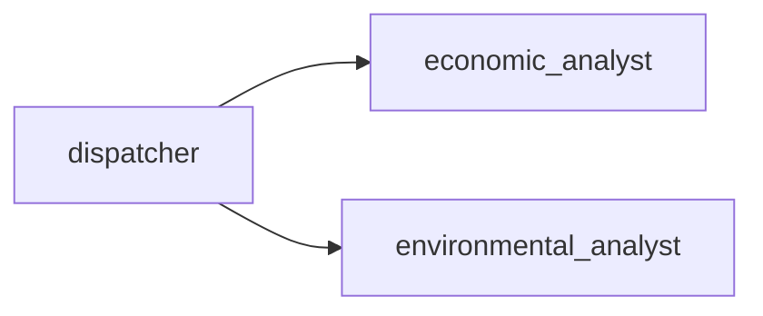
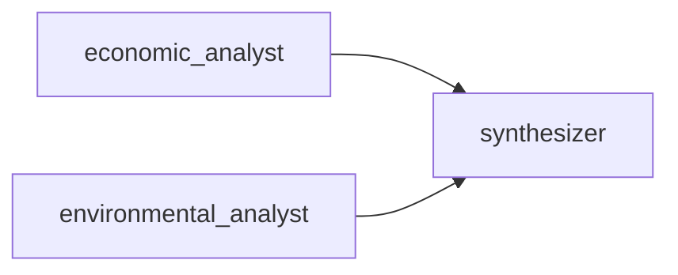
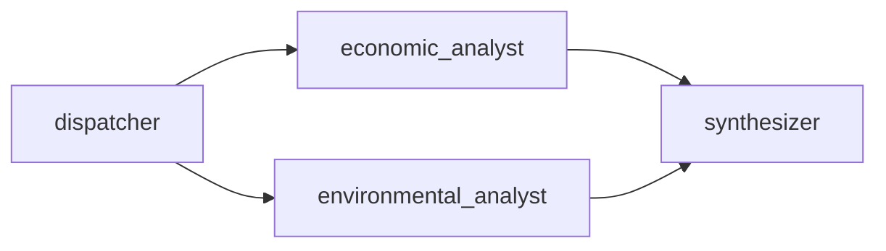
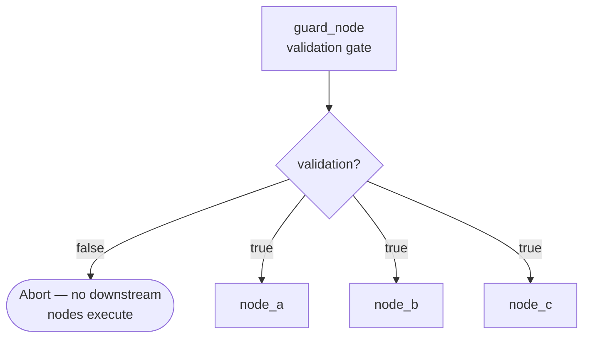
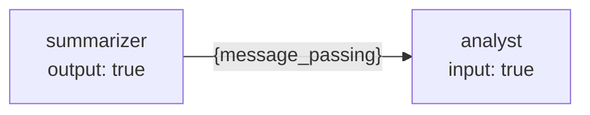
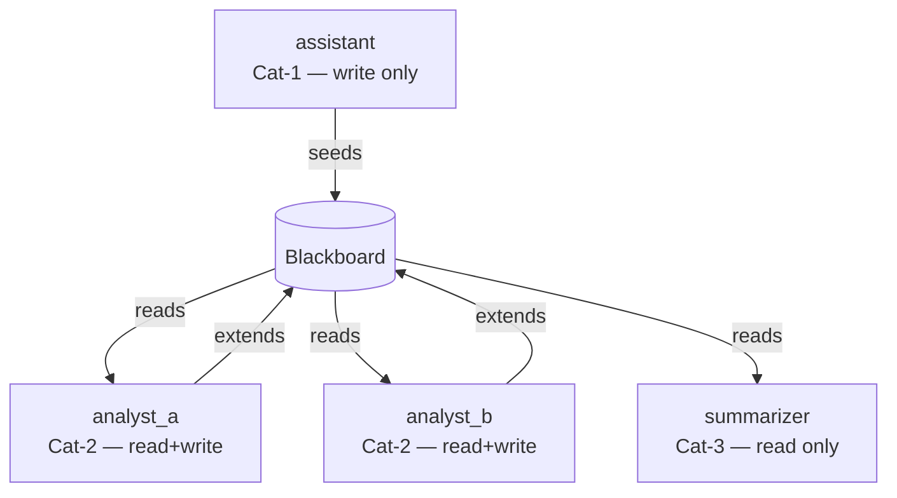
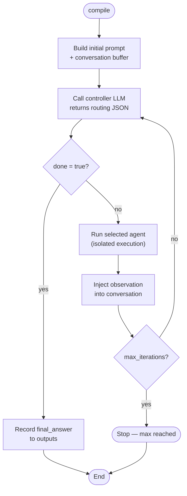
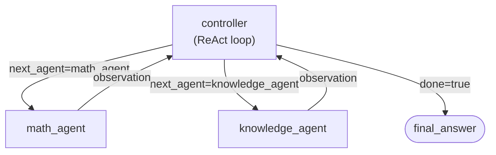
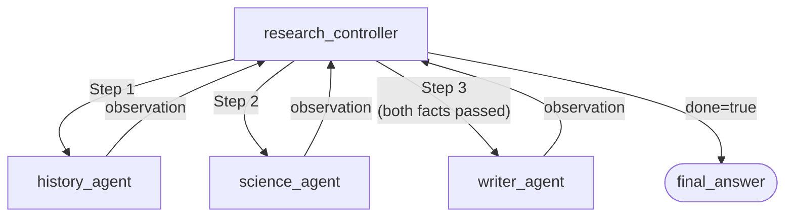
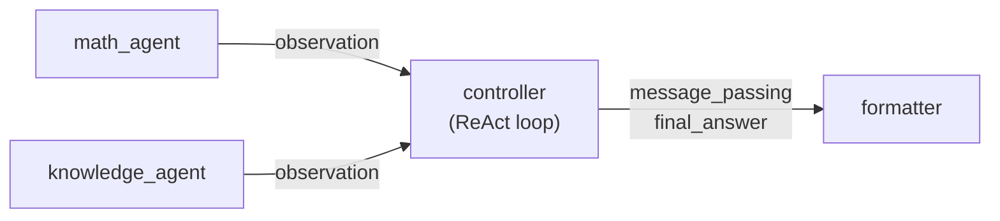

# KeGAL Tutorials

Worked examples covering the main features of the framework. Each tutorial is
self-contained — you can read them in any order.

## Table of Contents

- [1. Attaching Python tool executors](#1-attaching-python-tool-executors)
- [2. MCP servers](#2-mcp-servers)
- [3. Fan-out and fan-in edges](#3-fan-out-and-fan-in-edges)
- [4. Guard nodes (validation gate)](#4-guard-nodes-validation-gate)
- [5. Message passing](#5-message-passing)
- [6. Structured output](#6-structured-output)
- [7. Multi-provider graphs](#7-multi-provider-graphs)
- [8. RAG — injecting retrieved chunks](#8-rag--injecting-retrieved-chunks)
- [9. Blackboard — multi-board shared markdown pipeline](#9-blackboard--multi-board-shared-markdown-pipeline)
- [10. ReAct loop — iterative agent dispatch](#10-react-loop--iterative-agent-dispatch)

---

## 1. Attaching Python tool executors

Nodes can call Python functions as tools without spinning up a separate process.
Pass a `tool_executors` dict mapping tool names to callables when creating the
`Compiler`.

```python
def search_kb(query: str) -> str:
    # Your retrieval logic here
    return "Relevant content for: " + query

from kegal import Compiler

with Compiler(
    uri="path/to/your_graph.yml",
    tool_executors={"search_kb": search_kb},
) as compiler:
    compiler.compile()
    outputs = compiler.get_outputs()
```

The tool name must match what the LLM receives in its tool list. Declare the
tool in the YAML under the top-level `tools` key and reference it by index on
each node that should have access to it:

```yaml
tools:
  - name: "search_kb"
    description: "Search the knowledge base for relevant content."
    parameters:
      type: object
      properties:
        query:
          type: string
          description: "The search query."
      required: ["query"]

nodes:
  - id: "research_node"
    model: 0
    temperature: 0.2
    max_tokens: 512
    show: true
    message_passing:
      input: false
      output: false
    tools: ["search_kb"]  # name matching LLMTool.name in the top-level tools list
    prompt:
      template: 0
      user_message: true
```

---

## 2. MCP servers

The [Model Context Protocol](https://modelcontextprotocol.io) lets a node call
tools that live in a separate process (or remote service) rather than in-process
Python functions. KeGAL supports both `stdio` (subprocess) and `sse` (HTTP)
transports.

### How it works

1. Declare the server(s) in the top-level `mcp_servers` list.
2. Reference the server by its list index in the `mcp_servers` field of every
   node that should have access to it.
3. `Compiler.__init__` connects to each server automatically. `close()`
   shuts them all down cleanly.

### Step 1 — Write a server

Any MCP-compatible server works. A minimal example using
[`fastmcp`](https://github.com/jlowin/fastmcp):

```python
# my_server.py
from mcp.server.fastmcp import FastMCP

mcp = FastMCP("my-server")

@mcp.tool()
def greet(name: str) -> str:
    """Return a greeting for the given name."""
    return f"Hello, {name}!"

if __name__ == "__main__":
    mcp.run(transport="stdio")
```

### Step 2 — Configure the graph (YAML)

```yaml
models:
  - llm: "ollama"
    model: "ministral-3:3b"
    host: "http://localhost:11434"

mcp_servers:
  - id: "greeter"          # arbitrary identifier
    transport: "stdio"
    command: "python"
    args: ["my_server.py"]

user_message: "What is the greeting for Alice?"

prompts:
  - template:
      system_template:
        role: |
          You are a helpful assistant. Use the greet tool to answer.
      prompt_template:
        instruction: |
          {user_message}

nodes:
  - id: "greeter_node"
    model: 0
    temperature: 0.0
    max_tokens: 128
    show: true
    message_passing:
      input: false
      output: false
    mcp_servers: ["greeter"]   # id matching GraphMcpServer.id in the top-level mcp_servers list
    prompt:
      template: 0
      user_message: true

edges:
  - node: "greeter_node"
```

### Step 3 — Run

```python
from kegal import Compiler

with Compiler(uri="path/to/graph.yml") as compiler:
    compiler.compile()
    for node in compiler.get_outputs().nodes:
        for msg in node.response.messages or []:
            print(f"[{node.node_id}] {msg}")
```

### SSE transport

For a remote server (e.g. a running HTTP service), use `sse` transport and
provide a `url` instead of `command`/`args`:

```yaml
mcp_servers:
  - id: "remote_tools"
    transport: "sse"
    url: "http://my-tools-service:8080/sse"
```

### Chaining MCP output into the next node

A common pattern is to have one node query a tool and pass its raw output to a
second node for analysis. Set `message_passing.output: true` on the first node
and `message_passing.input: true` on the second; the message-passing inference
stage will schedule them in order automatically:

```yaml
nodes:
  - id: "query_node"
    ...
    message_passing:
      input: false
      output: true          # result is forwarded downstream
    mcp_servers: ["greeter"]

  - id: "analyst_node"
    ...
    message_passing:
      input: true           # receives query_node output as {message_passing}
      output: false
    prompt:
      template: 1           # template uses the {message_passing} placeholder
```

See [graph_doc.md](graph_doc.md) for the full `GraphMcpServer` field reference.

---

## 3. Fan-out and fan-in edges

`children` (fan-out) and `fan_in` are the two edge primitives for parallel
execution. They are recursive and composable.

### Fan-out: dispatch work in parallel

When a node has `children`, those children start simultaneously as soon as the
parent completes:



```yaml
edges:
  - node: "dispatcher"
    children:
      - node: "economic_analyst"
      - node: "environmental_analyst"
```

### Fan-in: wait for multiple branches

`fan_in` makes a node wait for every listed node before it starts:



```yaml
edges:
  - node: "synthesizer"
    fan_in:
      - node: "economic_analyst"
      - node: "environmental_analyst"
```

### Combined pipeline



```yaml
edges:
  - node: "dispatcher"
    children:
      - node: "economic_analyst"
      - node: "environmental_analyst"
  - node: "synthesizer"
    fan_in:
      - node: "economic_analyst"
      - node: "environmental_analyst"
```

Both primitives are recursive — a child can itself have `children` or `fan_in`,
enabling arbitrarily deep task trees.

---

## 4. Guard nodes (validation gate)

A guard node is a node whose `structured_output` schema contains a boolean field
named `validation`. When the LLM returns `validation: false`, the compiler
aborts execution and no downstream nodes run. This is the standard pattern for
content moderation and prompt injection prevention.



```yaml
nodes:
  - id: "guard_node"
    model: 0
    temperature: 0.0
    max_tokens: 64
    show: false
    message_passing:
      input: false
      output: false
    structured_output:
      type: object
      properties:
        validation:
          type: boolean
          description: "true if the input is safe to process, false otherwise."
      required: ["validation"]
    prompt:
      template: 0
      user_message: true
```

The guard node does not need to appear in `edges`. KeGAL automatically inserts it
as a barrier: every other node depends on it, so it always runs first.

```python
compiler = Compiler(uri="path/to/graph.yml")
compiler.user_message = "DROP TABLE users;"   # adversarial input
compiler.compile()

outputs = compiler.get_outputs()
executed = {n.node_id for n in outputs.nodes}
# only "guard_node" is in executed — downstream nodes never ran
```

---

## 5. Message passing

Message passing allows one node's response to flow into the next node's prompt as
the `{message_passing}` placeholder.



```yaml
nodes:
  - id: "summarizer"
    ...
    message_passing:
      input: false
      output: true    # this node's response is forwarded

  - id: "analyst"
    ...
    message_passing:
      input: true     # receives the summarizer's response
      output: false
    prompt:
      template: 1     # template must contain {message_passing}
```

```yaml
# template for analyst
prompts:
  - template:
      system_template:
        role: |
          You are an analyst.
      prompt_template:
        context: |
          {message_passing}
        instruction: |
          Based on the above summary, identify the three key risks.
```

The scheduler infers the dependency automatically: `summarizer` is placed at an
earlier topological level than `analyst` without any explicit edge entry.

---

## 6. Structured output

Use `structured_output` on a node to constrain the LLM response to a specific
JSON schema. The compiler parses the response and makes the structured fields
available for downstream use (e.g. guard logic, conditional branching).

```yaml
nodes:
  - id: "classifier"
    model: 0
    temperature: 0.0
    max_tokens: 128
    show: true
    message_passing:
      input: false
      output: false
    structured_output:
      type: object
      properties:
        category:
          type: string
          enum: ["technical", "billing", "general"]
        confidence:
          type: number
      required: ["category", "confidence"]
    prompt:
      template: 0
      user_message: true
```

---

## 7. Multi-provider graphs

Different nodes in the same graph can use different LLM providers. Declare each
model in the top-level `models` list and reference them by index on each node:

```yaml
models:
  - llm: "ollama"
    model: "ministral-3:3b"
    host: "http://localhost:11434"
  - llm: "anthropic"
    model: "claude-sonnet-4-6"
    api_key: "sk-ant-..."

nodes:
  - id: "fast_classifier"
    model: 0             # uses Ollama (cheap, fast)
    ...

  - id: "deep_analyst"
    model: 1             # uses Anthropic (more capable)
    ...
```

---

## 8. RAG — injecting retrieved chunks

Pass retrieved document chunks into a node's prompt via the `retrieved_chunks`
field on the compiler (or in the YAML) and reference them with
`{retrieved_chunks}` in a prompt template:

```python
with Compiler(uri="path/to/graph.yml") as compiler:
    compiler.retrieved_chunks = my_retriever.query(user_question)
    compiler.user_message = user_question
    compiler.compile()
```

```yaml
prompts:
  - template:
      system_template:
        role: |
          You are a helpful assistant. Answer only from the provided context.
      prompt_template:
        context: |
          {retrieved_chunks}
        question: |
          {user_message}
```

Set `retrieved_chunks: true` on the node's `prompt` block to enable injection:

```yaml
nodes:
  - id: "rag_node"
    ...
    prompt:
      template: 0
      user_message: true
      retrieved_chunks: true
```

---

## 9. Blackboard — multi-board shared markdown pipeline

The **blackboard** is a persistent markdown document that nodes can read from and
write to during a single `compile()` run. It implements the classic
[Blackboard architectural pattern](https://en.wikipedia.org/wiki/Blackboard_(design_pattern))
from AI systems — a shared workspace where multiple agents contribute and consume
content. It is the idiomatic way to build multi-agent pipelines where a writer
seeds context, enrichers extend it in parallel, and a final reader summarises
the whole thread.

KeGAL supports **multiple named boards** in the same graph. Each board has an `id`,
a file on disk, optional `cleanup` behaviour, and an optional `import` chain
that prepends other boards' content when the board is read.

### Node categories

| Category | `read` | `write` | Role |
|----------|--------|---------|------|
| Cat-1 | `false` | `true`  | **Writer** — seeds the board. |
| Cat-2 | `true`  | `true`  | **Enricher** — reads then extends; multiple Cat-2 nodes run in parallel. |
| Cat-3 | `true`  | `false` | **Reader** — consumes the final board. |



The execution order (Cat-1 → Cat-2 in parallel → Cat-3) is **inferred
automatically** from the flags even when `edges` is a flat list — no
`children`/`fan_in` declarations are needed.

### Step 1 — Configure the boards

Add a `blackboard:` block at the top level of the YAML. Declare the directory
where board files live (`path:`) and a list of named boards:

```yaml
blackboard:
  path: ./                  # directory relative to the YAML file
  boards:
    - id: main
      file: BLACKBOARD.md
      cleanup: true         # truncate file at Compiler init (default)
```

`cleanup: true` (the default) truncates the file to empty when the `Compiler`
is constructed, so each `compile()` run starts from a clean slate. Set
`cleanup: false` to keep any existing content — useful when accumulating across
multiple runs.

To use more than one board, add additional entries:

```yaml
blackboard:
  path: ./
  boards:
    - id: draft
      file: DRAFT.md
      cleanup: true
    - id: review
      file: REVIEW.md
      cleanup: true
      import: [draft]       # reading review prepends draft's content first
```

### Step 2 — Mark nodes with blackboard flags

Each node that participates in a board declares `blackboard:` with three fields:
`id` (which board), `read`, and `write`.

```yaml
nodes:
  - id: "assistant"          # Cat-1: write only
    model: 0
    temperature: 0.3
    max_tokens: 200
    show: false
    blackboard:
      id: main
      read: false
      write: true
    prompt:
      template: 0
      user_message: true

  - id: "analyst_a"          # Cat-2: read + write (parallel with analyst_b)
    model: 0
    temperature: 0.5
    max_tokens: 400
    show: false
    blackboard:
      id: main
      read: true
      write: true
    prompt:
      template: 1             # template uses {blackboard}

  - id: "analyst_b"          # Cat-2: read + write (parallel with analyst_a)
    model: 0
    temperature: 0.5
    max_tokens: 400
    show: false
    blackboard:
      id: main
      read: true
      write: true
    prompt:
      template: 2             # template uses {blackboard}

  - id: "summarizer"         # Cat-3: read only
    model: 0
    temperature: 0.5
    max_tokens: 800
    show: true
    blackboard:
      id: main
      read: true
      write: false
    prompt:
      template: 3             # template uses {blackboard}

edges:
  - node: "assistant"
  - node: "analyst_a"
  - node: "analyst_b"
  - node: "summarizer"
```

### Step 3 — Reference `{blackboard}` in prompt templates

Any node with `blackboard.read: true` has the current board content injected as
`{blackboard}`. No extra `prompt_placeholders` entry is required:

```yaml
prompts:
  - template:                        # template 1 — analyst_a
      system_template:
        role: |
          You are a business analyst.
      prompt_template:
        context: |
          State of discussion:
          {blackboard}
        instruction: |
          Analyze the main economic implications. Max 200 words.
```

### Step 4 — Run

```python
from kegal import Compiler

with Compiler(uri="path/to/graph.yml") as compiler:
    compiler.compile()
    outputs = compiler.get_outputs()
    for node in outputs.nodes:
        if node.show:
            print(f"[{node.node_id}]")
            for msg in node.response.messages or []:
                print(msg)
```

After `compile()` the board file on disk will contain the full accumulated
thread: seed from `assistant`, extensions from both analysts, ready for the
summarizer to consume.

---

## 10. ReAct loop — iterative agent dispatch

The ReAct (Reason + Act) pattern lets a **controller** node reason across multiple
turns, dispatching sub-tasks to **agent** nodes one at a time, observing their
outputs, and deciding what to do next. Useful for open-ended tasks where the
number of steps is not known in advance.

### How it works



The controller's `react_output` schema defines what the LLM must return each turn:

| Field          | Required | Description |
|----------------|----------|-------------|
| `next_agent`   | Yes      | Name of the agent to call next. |
| `done`         | No       | `true` to stop the loop and emit the final answer. |
| `agent_input`  | No       | Text passed to the agent via `message_passing`. Falls back to `reasoning` if absent. |
| `reasoning`    | No       | Internal chain-of-thought (logged in the trace). |
| `final_answer` | No       | Summary answer written when `done: true`. |

### Step 1 — Define prompts

```yaml
prompts:
  # 0 — controller
  - template:
      system_template:
        role: |
          You are a task coordinator. Dispatch sub-questions one at a time.
          Available agents:
            - math_agent: arithmetic calculations
            - knowledge_agent: factual questions
          Return JSON: next_agent, agent_input, done (true when finished), final_answer, reasoning.
      prompt_template:
        task: |
          Handle this request step by step: {user_message}

  # 1 — math agent
  - template:
      system_template:
        role: You are a calculator. Answer concisely.
      prompt_template:
        question: "{message_passing}"

  # 2 — knowledge agent
  - template:
      system_template:
        role: You are a knowledge assistant. Answer concisely.
      prompt_template:
        question: "{message_passing}"
```

### Step 2 — Define nodes

The controller node uses `react:` for loop config and `react_output:` for the
routing schema. Agent nodes are normal nodes with `message_passing.input: true`
to receive the controller's `agent_input`.

```yaml
nodes:
  - id: "controller"
    model: 0
    temperature: 0.0
    max_tokens: 512
    show: true
    prompt:
      template: 0
      user_message: true
    react:
      max_iterations: 6
    react_output:
      type: object
      properties:
        next_agent:   { type: string }
        agent_input:  { type: string }
        done:         { type: boolean }
        final_answer: { type: string }
        reasoning:    { type: string }
      required: [next_agent]

  - id: "math_agent"
    model: 0
    temperature: 0.0
    max_tokens: 64
    show: true
    message_passing: { input: true, output: true }
    prompt:
      template: 1

  - id: "knowledge_agent"
    model: 0
    temperature: 0.0
    max_tokens: 64
    show: true
    message_passing: { input: true, output: true }
    prompt:
      template: 2
```

### Step 3 — Declare edges

Agent nodes are listed in the controller's `react:` edge list. They are **excluded
from the main DAG** and only run when the controller dispatches to them.

```yaml
edges:
  - node: "controller"
    react:
      - node: "math_agent"
      - node: "knowledge_agent"
```



### Step 4 — Run and inspect the trace

```python
from kegal import Compiler

with Compiler(uri="path/to/react_graph.yml") as compiler:
    compiler.compile()

    # Standard output (controller's final answer)
    outputs = compiler.get_outputs()
    for node in outputs.nodes:
        if node.node_id == "controller" and node.response.json_output:
            print("Final answer:", node.response.json_output.get("final_answer"))

    # Detailed per-iteration trace
    trace = compiler.get_react_trace("controller")
    print(f"Iterations: {trace.total_iterations}, done: {trace.done}")
    for it in trace.iterations:
        print(f"  [{it.iteration}] → {it.agent_name}: {it.agent_output[:80]}")
```

### Resume: automatic conversation compaction

For long loops the conversation buffer can grow beyond the model's context window.
Set `resume: true` to compact it automatically when `input_size` reaches
`resume_threshold × max_tokens`:

```yaml
react:
  max_iterations: 20
  resume: true
  resume_threshold: 0.75   # compact when 75% of max_tokens used as input
```

A built-in compact prompt is used by default (instructs the LLM to compress the
conversation into a dense state record). To use your own:

```yaml
react_compact_prompts:
  - template:
      system_template:
        instruction: |
          Compress the conversation into a structured record. Preserve ALL findings.
          Do not summarise — compact.
      prompt_template:
        action: |
          Compact the above conversation now.
```

Or point to an external file:

```yaml
react_compact_prompts:
  - uri: "./prompts/compact_prompt.yml"
```

### Controller vs agent feature support

The controller and agent nodes run through different code paths, so not every node
feature is available on both sides.

| Feature | Controller | Agent nodes |
|---|---|---|
| `tools` | ✗ ignored — warning at init | ✓ full tool loop |
| `mcp_servers` | ✗ ignored — warning at init | ✓ full tool loop |
| `blackboard.read` / `.write` | ✗ ignored — warning at init | ✓ writes persist globally across iterations |
| `message_passing.input` | ✓ seeds the initial conversation | ✓ receives `agent_input` |
| `message_passing.output` | ✓ pushes `final_answer` to shared buffer | ✓ result returned to controller |
| `images` / `pdfs` | ✓ included in every LLM call | ✓ standard |
| `chat_history` | ✓ seeds the conversation buffer | ✓ standard |
| `user_message` | ✓ first turn in the conversation | ✓ standard |

> **Rule of thumb:** put tools and MCP on the agent nodes, never on the controller.
> If the controller needs information, dispatch an agent that has the tool.

### Using tools inside an agent

Agent nodes participate in the normal tool loop — the model may call tools across
multiple turns before returning its final output to the controller.

```yaml
models:
  - llm: "ollama"
    model: "qwen2.5:7b"

tools:
  - name: "get_exchange_rate"
    description: "Returns the current exchange rate between two currencies."
    input_schema:
      type: object
      properties:
        from_currency: { type: string }
        to_currency:   { type: string }
      required: [from_currency, to_currency]

prompts:
  # 0 — controller
  - template:
      system_template:
        role: |
          You are a finance coordinator. Available agents:
            - fx_agent: retrieves live exchange rates
          Return JSON: next_agent, agent_input, done, final_answer, reasoning.
      prompt_template:
        task: "{user_message}"

  # 1 — fx agent (has tool access)
  - template:
      system_template:
        role: Use the get_exchange_rate tool to answer the question.
      prompt_template:
        question: "{message_passing}"

nodes:
  - id: "controller"
    model: 0
    temperature: 0.0
    max_tokens: 512
    prompt: { template: 0, user_message: true }
    react:
      max_iterations: 4
    react_output:
      type: object
      properties:
        next_agent:   { type: string }
        agent_input:  { type: string }
        done:         { type: boolean }
        final_answer: { type: string }
        reasoning:    { type: string }
      required: [done]

  - id: "fx_agent"
    model: 0
    temperature: 0.0
    max_tokens: 256
    message_passing: { input: true, output: true }
    prompt: { template: 1 }
    tools: [0]               # ← tool assigned to the agent, NOT the controller

edges:
  - node: "controller"
    react:
      - node: "fx_agent"
```

Wire up the tool executor in Python:

```python
def get_exchange_rate(from_currency: str, to_currency: str) -> str:
    # call your real FX API here
    return f"1 {from_currency} = 1.08 {to_currency}"

with Compiler(
    uri="path/to/fx_graph.yml",
    tool_executors={"get_exchange_rate": get_exchange_rate},
) as compiler:
    compiler.compile()
    trace = compiler.get_react_trace("controller")
    print(trace.final_answer)
```

### Using MCP servers inside an agent

```yaml
mcp_servers:
  - id: "sqlite"
    type: "stdio"
    command: "python"
    args: ["mcp_sqlite_server.py", "--db", "data.db"]

nodes:
  - id: "db_agent"
    model: 0
    max_tokens: 256
    message_passing: { input: true, output: true }
    prompt: { template: 1 }
    mcp_servers: ["sqlite"]  # ← MCP on the agent, NOT the controller
```

The MCP tool loop runs inside the agent's isolated execution context — tool calls
are made, results are injected, and only the final answer is returned to the
controller as an observation.

### Multi-agent synthesis pattern

A common ReAct pattern is to gather information from multiple specialist agents
before synthesising a final answer with a writer agent.



Each observation is injected into the controller's conversation buffer, so by the
time `writer_agent` is dispatched the controller can pass both facts in
`agent_input`. See `test/graphs/react_research_graph.yml` for a complete working
example with three specialist agents (`history_agent`, `science_agent`,
`writer_agent`).

### Piping the controller's result to a downstream node

Once the ReAct loop finishes and emits a `final_answer`, you can forward it to a
regular **post-processing node** using `message_passing` — exactly like Tutorial 5.
Set `message_passing.output: true` on the controller and `message_passing.input: true`
on the downstream node. The scheduler infers the dependency and places the
post-processor at a later topological level automatically; no `fan_in` is needed.



**YAML — full example**

```yaml
models:
  - llm: "ollama"
    model: "qwen2.5:7b"
    host: "http://localhost:11434"

user_message: "What is 12 * 8, and what is the capital of Japan?"

prompts:
  # 0 — controller
  - template:
      system_template:
        role: |
          You are a task coordinator. Dispatch sub-questions one at a time.
          Available agents:
            - math_agent    : arithmetic calculations
            - knowledge_agent : factual questions
          Return JSON: next_agent, agent_input, done, final_answer, reasoning.
          Set done=true only after all questions are answered.
      prompt_template:
        task: "{user_message}"

  # 1 — math agent
  - template:
      system_template:
        role: "You are a calculator. Answer in one sentence."
      prompt_template:
        question: "{message_passing}"

  # 2 — knowledge agent
  - template:
      system_template:
        role: "You are a geography assistant. Answer in one sentence."
      prompt_template:
        question: "{message_passing}"

  # 3 — post-processor (receives controller final_answer)
  - template:
      system_template:
        role: |
          You are a report formatter. Take the raw findings below and rewrite
          them as two clearly numbered bullet points. No prose, no headings.
      prompt_template:
        findings: "{message_passing}"

nodes:
  - id: "controller"
    model: 0
    temperature: 0.0
    max_tokens: 512
    show: true
    prompt:
      template: 0
      user_message: true
    message_passing:
      input: false
      output: true          # final_answer is written to the message pipe
    react:
      max_iterations: 6
    react_output:
      type: object
      properties:
        next_agent:   { type: string, enum: ["math_agent", "knowledge_agent"] }
        agent_input:  { type: string }
        done:         { type: boolean }
        final_answer: { type: string }
        reasoning:    { type: string }
      required: [done]

  - id: "math_agent"
    model: 0
    temperature: 0.0
    max_tokens: 64
    show: true
    message_passing: { input: true, output: true }
    prompt:
      template: 1

  - id: "knowledge_agent"
    model: 0
    temperature: 0.0
    max_tokens: 64
    show: true
    message_passing: { input: true, output: true }
    prompt:
      template: 2

  - id: "formatter"
    model: 0
    temperature: 0.0
    max_tokens: 128
    show: true
    message_passing:
      input: true           # receives the controller's final_answer
      output: false
    prompt:
      template: 3

edges:
  - node: "controller"
    react:
      - node: "math_agent"
      - node: "knowledge_agent"
  - node: "formatter"
```

The message_passing inference stage reads the edge declaration order and adds
`deps[formatter] → controller` automatically — exactly as it does for any two
consecutive nodes in Tutorial 5. No `fan_in` required.

> **Warning:** if you set `message_passing.output: true` on a controller but no
> downstream node has `message_passing.input: true`, KeGAL logs a warning at init
> time: *"the output will not be consumed"*.

**Python**

```python
from kegal import Compiler

with Compiler(uri="path/to/react_post_graph.yml") as compiler:
    compiler.compile()

    # Controller's raw final_answer
    trace = compiler.get_react_trace("controller")
    print("Raw answer:", trace.final_answer)

    # Formatter's polished output
    outputs = compiler.get_outputs()
    for node in outputs.nodes:
        if node.node_id == "formatter":
            for msg in node.response.messages or []:
                print("Formatted:\n", msg)
```
