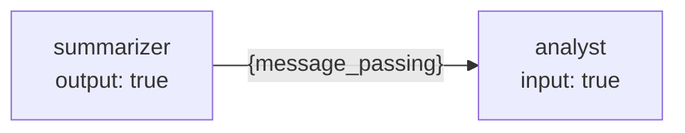
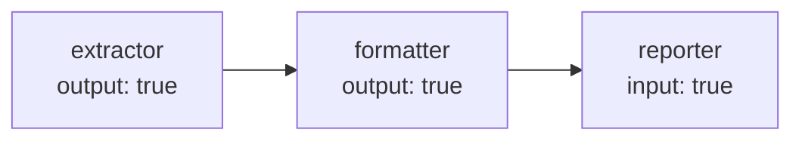
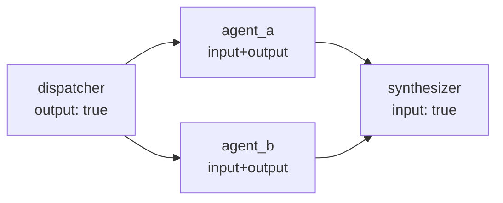

# Tutorial 1: Message Passing

Message passing is the mechanism for flowing text from one node to the next.
A node with `message_passing.output: true` appends its response to a shared
pipe after it finishes; a node with `message_passing.input: true` receives the
accumulated pipe content as the `{message_passing}` placeholder in its prompt.

The scheduler infers the dependency automatically — no explicit edge
declarations are needed for a linear chain.

---

## 1. Basic: two-node pipeline

The simplest pattern is one producer and one consumer.



```yaml
models:
  - llm: "ollama"
    model: "qwen2.5:7b"
    host: "http://localhost:11434"

prompts:
  # 0 — summarizer
  - template:
      system_template:
        role: |
          You are a summarizer. Produce a concise bullet-point summary
          of the text provided. Max 5 bullets.
      prompt_template:
        text: |
          {user_message}

  # 1 — analyst: receives the summary
  - template:
      system_template:
        role: |
          You are a risk analyst.
          Given the summary below, identify the top three risks.
      prompt_template:
        summary: |
          {message_passing}

nodes:
  - id: "summarizer"
    model: 0
    temperature: 0.3
    max_tokens: 256
    show: false
    message_passing:
      output: true
    prompt:
      template: 0
      user_message: true

  - id: "analyst"
    model: 0
    temperature: 0.5
    max_tokens: 512
    show: true
    message_passing:
      input: true
    prompt:
      template: 1

edges:
  - node: "summarizer"
  - node: "analyst"
```

```python
from kegal import Compiler

with Compiler(uri="pipeline.yml") as compiler:
    compiler.user_message = "... long document text ..."
    compiler.compile()

    for node in compiler.get_outputs().nodes:
        if node.node_id == "analyst":
            for msg in node.response.messages:
                print(msg)
```

The `edges` list here is optional — declaring both nodes in `nodes` with
matching `output`/`input` flags is enough for the scheduler to infer the
ordering. The explicit `edges` entries just make the intent readable.

---

## 2. Intermediate: three-node chain

Multiple output nodes accumulate into the pipe in execution order. A later
input node sees everything written before it.



```yaml
models:
  - llm: "ollama"
    model: "qwen2.5:7b"
    host: "http://localhost:11434"

prompts:
  # 0 — extractor: pull raw facts
  - template:
      system_template:
        role: Extract the key facts from the text as a numbered list.
      prompt_template:
        text: "{user_message}"

  # 1 — formatter: rewrite facts in business language
  - template:
      system_template:
        role: |
          Rewrite the following numbered list in formal business English.
          Keep it concise.
      prompt_template:
        facts: "{message_passing}"

  # 2 — reporter: produce executive summary from the formatted list
  - template:
      system_template:
        role: |
          Write a 3-sentence executive summary based on the points below.
      prompt_template:
        points: "{message_passing}"

nodes:
  - id: "extractor"
    model: 0
    temperature: 0.0
    max_tokens: 256
    show: false
    message_passing:
      output: true
    prompt:
      template: 0
      user_message: true

  - id: "formatter"
    model: 0
    temperature: 0.3
    max_tokens: 256
    show: false
    message_passing:
      input: true
      output: true    # both: receives extractor's output, then forwards its own
    prompt:
      template: 1

  - id: "reporter"
    model: 0
    temperature: 0.4
    max_tokens: 256
    show: true
    message_passing:
      input: true
    prompt:
      template: 2
```

> **What does `reporter` see in `{message_passing}`?**  
> The pipe accumulates: extractor's text, then formatter's text, separated by
> blank lines. Both are visible to `reporter`. If you want `reporter` to see
> only the formatter's output, set `extractor`'s `output: false` and forward
> only through `formatter`.

---

## 3. Advanced: fan-out with message passing

When a parent fans out to parallel children, each child can independently read
or write the pipe. A fan-in node then sees all of their combined outputs.



```yaml
models:
  - llm: "ollama"
    model: "qwen2.5:7b"
    host: "http://localhost:11434"

prompts:
  - template:  # 0 — dispatcher
      system_template:
        role: "Decompose the research question into two independent sub-questions."
      prompt_template:
        question: "{user_message}"

  - template:  # 1 — agent_a: economic angle
      system_template:
        role: "Answer only the economic aspects of this question."
      prompt_template:
        context: "{message_passing}"

  - template:  # 2 — agent_b: environmental angle
      system_template:
        role: "Answer only the environmental aspects of this question."
      prompt_template:
        context: "{message_passing}"

  - template:  # 3 — synthesizer
      system_template:
        role: "Synthesise the findings below into a single cohesive answer."
      prompt_template:
        findings: "{message_passing}"

nodes:
  - id: "dispatcher"
    model: 0
    temperature: 0.2
    max_tokens: 256
    show: false
    message_passing: { output: true }
    prompt: { template: 0, user_message: true }

  - id: "agent_a"
    model: 0
    temperature: 0.5
    max_tokens: 512
    show: false
    message_passing: { input: true, output: true }
    prompt: { template: 1 }

  - id: "agent_b"
    model: 0
    temperature: 0.5
    max_tokens: 512
    show: false
    message_passing: { input: true, output: true }
    prompt: { template: 2 }

  - id: "synthesizer"
    model: 0
    temperature: 0.4
    max_tokens: 512
    show: true
    message_passing: { input: true }
    prompt: { template: 3 }

edges:
  - node: "dispatcher"
    children:
      - node: "agent_a"
      - node: "agent_b"
  - node: "synthesizer"
    fan_in:
      - node: "agent_a"
      - node: "agent_b"
```

> **Concurrent write warning:** if two nodes at the same topological level
> both have `output: true`, KeGAL logs a warning at init time — the order in
> which their outputs are appended to the pipe is non-deterministic. When
> predictable ordering matters, use a fan-in node to serialise.

---

## 4. Advanced: combining message passing with structured output

A structured-output node with `message_passing.output: true` serialises its
JSON object as a string before writing it to the pipe. The downstream node
receives the JSON text as `{message_passing}`.

```yaml
nodes:
  - id: "extractor"
    ...
    message_passing:
      output: true
    structured_output:
      description: "Key metrics"
      parameters:
        revenue_m: { type: "number" }
        growth_pct: { type: "number" }
      required: ["revenue_m", "growth_pct"]

  - id: "narrator"
    ...
    message_passing:
      input: true     # receives: '{"revenue_m": 120.5, "growth_pct": 14.2}'
    prompt:
      template: 1     # template uses {message_passing}
```

---

## Key points

- `output: true` writes; `input: true` reads. A node can do both.
- The pipe is a growing string — each output appends to what was already there.
- The scheduler infers ordering from the flags; explicit `edges` entries are
  optional for simple linear chains.
- Two concurrent `output: true` nodes produce a non-deterministic write order —
  use fan-in to serialise if ordering matters.
- Structured-output nodes serialise their JSON to a string when forwarding.

---

> **Related tutorials:**
> [02 Structured output](02_structured_output.md) — forwarding structured data downstream  
> [07 Fan-out and fan-in](07_fan_out_fan_in.md) — scheduling parallel branches  
> [12 ReAct loop](12_react_loop.md) — piping a controller's final answer to a post-processor
