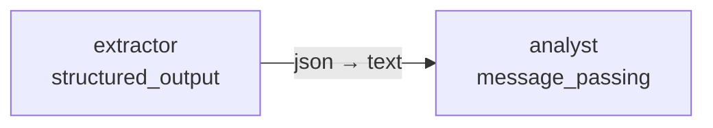

# Tutorial 2: Structured Output

Use `structured_output` to force an LLM node to return a specific JSON schema
instead of free-form text. The compiler parses the response automatically and
exposes it under `node.response.json_output`.

---

## 1. Basic: flat schema

The simplest case is a flat object with a handful of scalar fields.

```yaml
models:
  - llm: "ollama"
    model: "qwen2.5:7b"
    host: "http://localhost:11434"

prompts:
  - template:
      system_template:
        role: |
          You are a customer-support classifier.
          Classify the user message and estimate your confidence (0.0–1.0).
      prompt_template:
        message: |
          {user_message}

nodes:
  - id: "classifier"
    model: 0
    temperature: 0.0
    max_tokens: 128
    show: true
    prompt:
      template: 0
      user_message: true
    structured_output:
      description: "Support ticket classification"
      parameters:
        category:
          type: "string"
          enum: ["billing", "technical", "general"]
          description: "Which department should handle this ticket."
        confidence:
          type: "number"
          description: "Model confidence in the classification (0.0–1.0)."
      required: ["category", "confidence"]

edges:
  - node: "classifier"
```

Access the parsed fields in Python:

```python
from kegal import Compiler

with Compiler(uri="classifier.yml") as compiler:
    compiler.user_message = "My invoice shows a wrong amount."
    compiler.compile()

    for node in compiler.get_outputs().nodes:
        if node.node_id == "classifier":
            data = node.response.json_output
            print(data["category"])     # "billing"
            print(data["confidence"])   # 0.95
```

> **Note:** `json_output` is `None` when the node has no `structured_output`.
> Always check before accessing fields.

---

## 2. Intermediate: nested objects and arrays

Schemas can nest objects and lists. Use `LLMStructuredSchema` field types
(`object`, `array`, `string`, `number`, `boolean`, `integer`) freely.

```yaml
models:
  - llm: "ollama"
    model: "qwen2.5:7b"
    host: "http://localhost:11434"

prompts:
  - template:
      system_template:
        role: |
          You are a product-review analyst.
          Extract structured information from the review text.
      prompt_template:
        review: |
          {user_message}

nodes:
  - id: "review_parser"
    model: 0
    temperature: 0.0
    max_tokens: 512
    show: true
    prompt:
      template: 0
      user_message: true
    structured_output:
      description: "Parsed product review"
      parameters:
        rating:
          type: "integer"
          description: "Star rating from 1 to 5."
        sentiment:
          type: "string"
          enum: ["positive", "neutral", "negative"]
        pros:
          type: "array"
          description: "List of positive points mentioned."
          items:
            type: "string"
        cons:
          type: "array"
          description: "List of negative points mentioned."
          items:
            type: "string"
        summary:
          type: "object"
          description: "A short summary object."
          properties:
            headline:
              type: "string"
              description: "One-sentence headline."
            recommend:
              type: "boolean"
              description: "Whether the reviewer recommends the product."
          required: ["headline", "recommend"]
      required: ["rating", "sentiment", "pros", "cons", "summary"]

edges:
  - node: "review_parser"
```

```python
with Compiler(uri="review_parser.yml") as compiler:
    compiler.user_message = (
        "Great battery life and solid build quality, but the camera is mediocre. "
        "Overall I'd recommend it for the price."
    )
    compiler.compile()

    data = compiler.get_outputs().nodes[0].response.json_output
    print(data["rating"])               # 4
    print(data["pros"])                 # ["battery life", "build quality"]
    print(data["summary"]["headline"])  # "Good value phone with a weak camera"
    print(data["summary"]["recommend"]) # True
```

---

## 3. Advanced: multi-node structured pipeline

A common pattern is to run one node to extract structured data, then pass
that data to a second node for reasoning. Combine `structured_output` with
`message_passing` to build a typed pipeline.



```yaml
models:
  - llm: "ollama"
    model: "qwen2.5:7b"
    host: "http://localhost:11434"

prompts:
  # 0 — extractor: pull key numbers from an earnings report
  - template:
      system_template:
        role: |
          You are a financial data extractor.
          Return only a JSON object — no prose.
      prompt_template:
        text: |
          {user_message}

  # 1 — analyst: interpret extracted numbers
  - template:
      system_template:
        role: |
          You are a financial analyst.
          The following structured data was extracted from an earnings report.
          Write a 2-sentence interpretation.
      prompt_template:
        data: |
          {message_passing}

nodes:
  - id: "extractor"
    model: 0
    temperature: 0.0
    max_tokens: 256
    show: false
    message_passing:
      output: true          # serialised JSON is forwarded downstream
    prompt:
      template: 0
      user_message: true
    structured_output:
      description: "Key financials from the earnings text"
      parameters:
        revenue_m:
          type: "number"
          description: "Revenue in millions USD."
        yoy_growth_pct:
          type: "number"
          description: "Year-over-year revenue growth, in percent."
        net_income_m:
          type: "number"
          description: "Net income in millions USD."
      required: ["revenue_m", "yoy_growth_pct", "net_income_m"]

  - id: "analyst"
    model: 0
    temperature: 0.5
    max_tokens: 256
    show: true
    message_passing:
      input: true
    prompt:
      template: 1

edges:
  - node: "extractor"
  - node: "analyst"
```

```python
with Compiler(uri="earnings_pipeline.yml") as compiler:
    compiler.user_message = (
        "Q3 revenue reached $1.24 B, up 18 % year-over-year. "
        "Net income was $312 M."
    )
    compiler.compile()

    outputs = compiler.get_outputs()
    for node in outputs.nodes:
        if node.node_id == "extractor":
            print("Extracted:", node.response.json_output)
        if node.node_id == "analyst":
            print("Analysis:", node.response.messages[0])
```

> **Note:** when a node has both `message_passing.output: true` and
> `structured_output`, the JSON object is serialised to a string before being
> written to the message pipe, so the downstream node receives it as
> `{message_passing}` text.

---

## 4. Advanced: using `validation` as a gate

Any `structured_output` schema that contains a boolean field named
`validation` is treated as a **guard** — see
[Tutorial 3: Guard nodes](03_guard_nodes.md) for the full treatment. The
key point is that `validation: false` aborts the graph immediately; no
downstream nodes run.

```yaml
structured_output:
  description: "Quality check"
  parameters:
    validation:
      type: "boolean"
      description: "true if the response meets quality standards."
    reason:
      type: "string"
      description: "Why the response passed or failed."
  required: ["validation", "reason"]
```

---

## Key points

- `structured_output` is defined per node; different nodes can have different schemas.
- `json_output` is `None` for nodes without `structured_output`.
- Enum values constrain the LLM's response and make downstream code more predictable.
- Nesting (`object` inside `object`, `array` of `object`) is fully supported.
- The `validation` field name is reserved — including it triggers the gate mechanism.
- Temperature `0.0` is recommended for structured output nodes to minimise JSON parse failures.

---

> **Related tutorials:**
> [03 Guard nodes](03_guard_nodes.md) — using `validation` to abort the graph  
> [01 Message passing](01_message_passing.md) — forwarding structured data to the next node  
> [04 RAG](04_rag.md) — combining retrieved context with structured extraction
