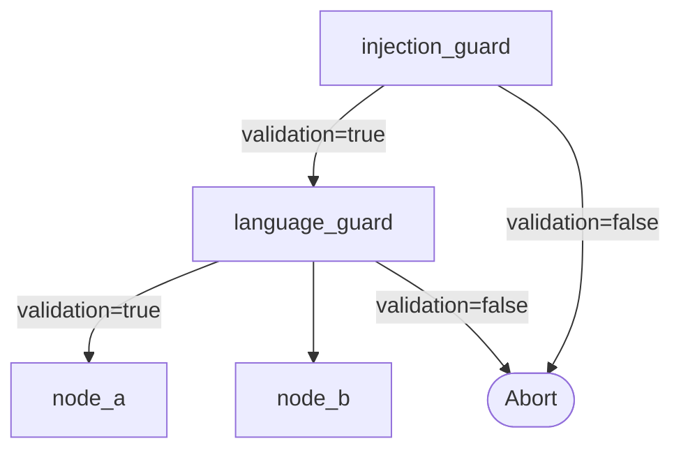
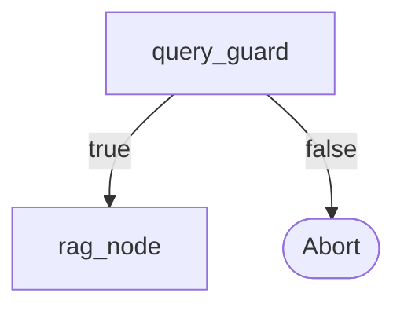

# Tutorial 3: Guard Nodes

A **guard node** is a node whose `structured_output` schema contains a boolean
field named `validation`. When the LLM returns `validation: false`, the
compiler aborts immediately — no downstream nodes execute. When it returns
`validation: true` (or the field is absent), execution continues normally.

Guards are the idiomatic KeGAL pattern for content moderation, prompt
injection prevention, input quality checks, and any other pre-flight
validation step.

---

## 1. Basic: single guard

Add a `structured_output` block with a `validation` boolean and a `prompt`
block — guard nodes must have a prompt.

```yaml
models:
  - llm: "ollama"
    model: "qwen2.5:7b"
    host: "http://localhost:11434"

prompts:
  # 0 — guard: content moderation
  - template:
      system_template:
        role: |
          You are a content moderator. Determine whether the user message
          is appropriate for a professional business setting.
          Return validation: true if appropriate, false otherwise.
      prompt_template:
        message: |
          {user_message}

  # 1 — main node (only runs if guard passes)
  - template:
      system_template:
        role: You are a helpful business assistant.
      prompt_template:
        request: "{user_message}"

nodes:
  - id: "moderation_guard"
    model: 0
    temperature: 0.0
    max_tokens: 128
    show: false
    prompt:
      template: 0
      user_message: true
    structured_output:
      description: "Content appropriateness check"
      parameters:
        validation:
          type: "boolean"
          description: "true if the message is appropriate, false otherwise."
        reason:
          type: "string"
          description: "Brief explanation of the decision."
      required: ["validation", "reason"]

  - id: "assistant"
    model: 0
    temperature: 0.5
    max_tokens: 512
    show: true
    prompt:
      template: 1
      user_message: true

edges:
  - node: "moderation_guard"
  - node: "assistant"
```

```python
from kegal import Compiler

with Compiler(uri="guarded_graph.yml") as compiler:
    compiler.user_message = "Help me draft a quarterly report."
    compiler.compile()

    outputs = compiler.get_outputs()
    executed = {n.node_id for n in outputs.nodes}

    if "assistant" in executed:
        print(outputs.nodes[-1].response.messages[0])
    else:
        # guard fired — check why
        guard = next(n for n in outputs.nodes if n.node_id == "moderation_guard")
        print("Blocked:", guard.response.json_output["reason"])
```

> **Automatic placement:** a guard node does **not** need to appear before the
> main node in `edges`. KeGAL automatically inserts it as a barrier: every
> non-guard node depends on it regardless of edge order.

---

## 2. Intermediate: guard with rich output

Guards can return more than just `validation`. Additional fields are available
in `json_output` for logging or conditional logic in the caller.

```yaml
nodes:
  - id: "injection_guard"
    model: 0
    temperature: 0.0
    max_tokens: 256
    show: false
    prompt:
      template: 0
      user_message: true
    structured_output:
      description: "Prompt injection detection"
      parameters:
        validation:
          type: "boolean"
          description: "true if the message is safe, false if injection detected."
        risk_level:
          type: "string"
          enum: ["none", "low", "medium", "high"]
          description: "Estimated injection risk level."
        indicators:
          type: "array"
          description: "List of suspicious patterns found (empty if none)."
          items:
            type: "string"
      required: ["validation", "risk_level", "indicators"]
```

```python
guard_out = next(
    n for n in compiler.get_outputs().nodes
    if n.node_id == "injection_guard"
)
data = guard_out.response.json_output
if not data["validation"]:
    print(f"Injection blocked [{data['risk_level']}]:", data["indicators"])
```

---

## 3. Advanced: multiple guards in sequence

Chain two guards — an injection guard followed by a language guard — so that
both conditions must pass before the main workflow begins.



Guards are executed in declaration order within the guard phase. If
`injection_guard` fails, `language_guard` never runs.

```yaml
nodes:
  - id: "injection_guard"
    model: 0
    temperature: 0.0
    max_tokens: 128
    show: false
    prompt:
      template: 0
      user_message: true
    structured_output:
      description: "Injection detection"
      parameters:
        validation:
          type: "boolean"
      required: ["validation"]

  - id: "language_guard"
    model: 0
    temperature: 0.0
    max_tokens: 128
    show: false
    prompt:
      template: 1
      user_message: true
    structured_output:
      description: "Language appropriateness check"
      parameters:
        validation:
          type: "boolean"
        language:
          type: "string"
          description: "Detected language code (e.g. 'en', 'fr')."
      required: ["validation", "language"]

  - id: "main_node"
    model: 0
    temperature: 0.5
    max_tokens: 512
    show: true
    prompt:
      template: 2
      user_message: true

edges:
  - node: "injection_guard"
  - node: "language_guard"
  - node: "main_node"
```

```python
with Compiler(uri="multi_guard.yml") as compiler:
    compiler.user_message = user_input
    compiler.compile()

    executed = {n.node_id for n in compiler.get_outputs().nodes}
    if "main_node" not in executed:
        # determine which guard fired
        for node in compiler.get_outputs().nodes:
            if node.node_id in ("injection_guard", "language_guard"):
                if node.response.json_output.get("validation") is False:
                    print(f"Blocked by {node.node_id}")
                    break
```

---

## 4. Advanced: guard + RAG pipeline

A guard positioned before a RAG step validates the query before any retrieval
is attempted. This avoids unnecessary retrieval for invalid inputs.



```yaml
prompts:
  # 0 — query guard: is the question answerable from a product knowledge base?
  - template:
      system_template:
        role: |
          You evaluate whether a user query is relevant to our product
          knowledge base. Approve only product-related questions.
      prompt_template:
        query: "{user_message}"

  # 1 — RAG node: answer from retrieved context
  - template:
      system_template:
        role: |
          Answer the question using only the context provided.
          If the context does not contain enough information, say so.
      prompt_template:
        context: |
          {retrieved_chunks}
        question: |
          {user_message}

nodes:
  - id: "query_guard"
    model: 0
    temperature: 0.0
    max_tokens: 128
    show: false
    prompt:
      template: 0
      user_message: true
    structured_output:
      description: "Query relevance check"
      parameters:
        validation:
          type: "boolean"
          description: "true if the query is answerable from the product KB."
      required: ["validation"]

  - id: "rag_node"
    model: 0
    temperature: 0.3
    max_tokens: 512
    show: true
    prompt:
      template: 1
      user_message: true
      retrieved_chunks: true

edges:
  - node: "query_guard"
  - node: "rag_node"
```

```python
with Compiler(uri="rag_guarded.yml") as compiler:
    compiler.user_message = query
    compiler.retrieved_chunks = retriever.query(query)
    compiler.compile()
```

---

## Key points

- A guard node must have a `prompt` block — omitting it raises `ValueError` at
  `compile()` time.
- The `validation` field name is reserved across the entire framework. Any
  node whose `structured_output` includes it becomes a guard.
- Guards run before all other nodes at their topological level, regardless of
  edge declaration order.
- Multiple guards execute sequentially in declaration order. The first one to
  return `false` aborts the graph.
- A guard's `json_output` is always available in the compiler output, even
  after an abort — useful for logging the reason.
- Temperature `0.0` is strongly recommended for guards to ensure consistent
  boolean decisions.

---

> **Related tutorials:**
> [02 Structured output](02_structured_output.md) — using structured_output for data extraction  
> [05 RAG](05_rag.md) — combining a guard with retrieval-augmented generation
