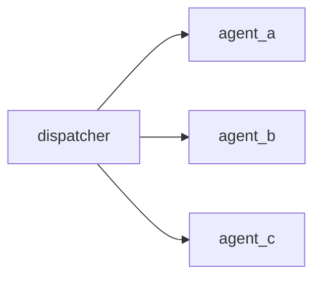
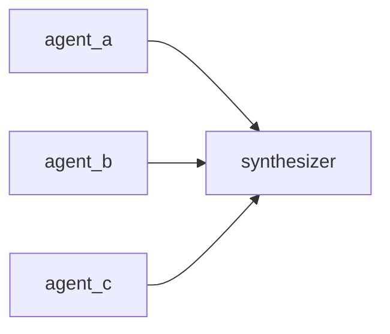
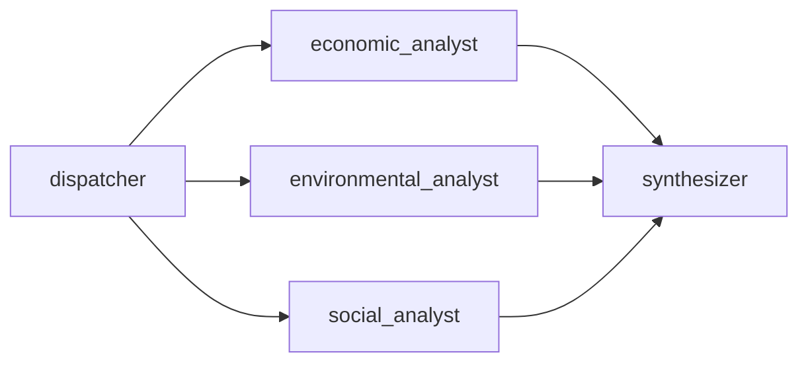
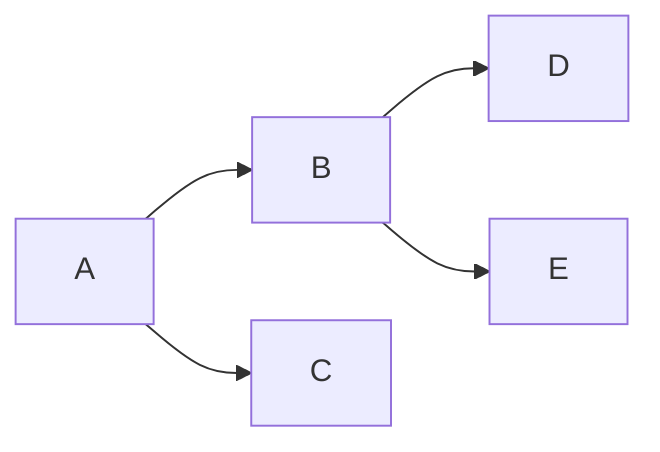

# Tutorial 4: Fan-out and Fan-in Edges

`children` (fan-out) and `fan_in` are the two edge primitives for
controlling parallel execution. They are recursive and composable, allowing
arbitrarily deep task trees.

---

## 1. Basic: fan-out — launch parallel branches

When a node has `children`, all children start simultaneously as soon as the
parent completes. This is the fundamental pattern for parallelism.



```yaml
models:
  - llm: "ollama"
    model: "qwen2.5:7b"
    host: "http://localhost:11434"

prompts:
  - template:  # 0 — dispatcher
      system_template:
        role: Decompose the research question into three sub-topics.
      prompt_template:
        question: "{user_message}"

  - template:  # 1 — economic angle
      system_template:
        role: Analyse only the economic aspects of the topic.
      prompt_template:
        topic: "{user_message}"

  - template:  # 2 — environmental angle
      system_template:
        role: Analyse only the environmental aspects of the topic.
      prompt_template:
        topic: "{user_message}"

  - template:  # 3 — social angle
      system_template:
        role: Analyse only the social aspects of the topic.
      prompt_template:
        topic: "{user_message}"

nodes:
  - id: "dispatcher"
    model: 0
    temperature: 0.2
    max_tokens: 256
    show: false
    prompt: { template: 0, user_message: true }

  - id: "economic_analyst"
    model: 0
    temperature: 0.5
    max_tokens: 512
    show: true
    prompt: { template: 1, user_message: true }

  - id: "environmental_analyst"
    model: 0
    temperature: 0.5
    max_tokens: 512
    show: true
    prompt: { template: 2, user_message: true }

  - id: "social_analyst"
    model: 0
    temperature: 0.5
    max_tokens: 512
    show: true
    prompt: { template: 3, user_message: true }

edges:
  - node: "dispatcher"
    children:
      - node: "economic_analyst"
      - node: "environmental_analyst"
      - node: "social_analyst"
```

```python
from kegal import Compiler

with Compiler(uri="fanout.yml") as compiler:
    compiler.user_message = "Impact of electric vehicles on urban areas."
    compiler.compile()

    outputs = compiler.get_outputs()
    for node in outputs.nodes:
        if node.show:
            print(f"\n[{node.node_id}]")
            for msg in node.response.messages or []:
                print(msg)
```

The three analyst nodes run **concurrently** — the total wall-clock time is
roughly the time of the slowest one, not their sum.

---

## 2. Basic: fan-in — wait for multiple branches

`fan_in` makes a node wait for every listed predecessor before it starts.
Use it to aggregate results from parallel branches.



```yaml
prompts:
  - template:  # 4 — synthesizer
      system_template:
        role: |
          Synthesise the three analyses below into a single balanced report.
      prompt_template:
        findings: "{message_passing}"

nodes:
  - id: "synthesizer"
    model: 0
    temperature: 0.4
    max_tokens: 768
    show: true
    message_passing: { input: true }
    prompt: { template: 4 }

edges:
  - node: "synthesizer"
    fan_in:
      - node: "economic_analyst"
      - node: "environmental_analyst"
      - node: "social_analyst"
```

> `synthesizer` will not start until all three analysts have finished.

---

## 3. Intermediate: combined fan-out + fan-in

The canonical parallel pipeline: a dispatcher fans out to specialists, and a
synthesiser fans in to aggregate.



```yaml
edges:
  - node: "dispatcher"
    children:
      - node: "economic_analyst"
      - node: "environmental_analyst"
      - node: "social_analyst"
  - node: "synthesizer"
    fan_in:
      - node: "economic_analyst"
      - node: "environmental_analyst"
      - node: "social_analyst"
```

> Nodes appear twice — once in `children` (who launches them) and once in
> `fan_in` (who waits for them). This is correct and intentional.

Full working example with message passing:

```yaml
models:
  - llm: "ollama"
    model: "qwen2.5:7b"
    host: "http://localhost:11434"

prompts:
  - template:  # 0 — dispatcher
      system_template:
        role: Briefly state the topic for downstream analysis.
      prompt_template:
        topic: "{user_message}"

  - template:  # 1 — economic
      system_template:
        role: Economic analysis specialist. Be concise — 3 bullets max.
      prompt_template:
        topic: "{user_message}"

  - template:  # 2 — environmental
      system_template:
        role: Environmental analysis specialist. Be concise — 3 bullets max.
      prompt_template:
        topic: "{user_message}"

  - template:  # 3 — social
      system_template:
        role: Social analysis specialist. Be concise — 3 bullets max.
      prompt_template:
        topic: "{user_message}"

  - template:  # 4 — synthesizer
      system_template:
        role: |
          Combine the specialist analyses below into a 2-paragraph summary.
      prompt_template:
        analyses: "{message_passing}"

nodes:
  - id: "dispatcher"
    model: 0
    temperature: 0.1
    max_tokens: 128
    show: false
    prompt: { template: 0, user_message: true }

  - id: "economic_analyst"
    model: 0
    temperature: 0.5
    max_tokens: 256
    show: false
    message_passing: { output: true }
    prompt: { template: 1, user_message: true }

  - id: "environmental_analyst"
    model: 0
    temperature: 0.5
    max_tokens: 256
    show: false
    message_passing: { output: true }
    prompt: { template: 2, user_message: true }

  - id: "social_analyst"
    model: 0
    temperature: 0.5
    max_tokens: 256
    show: false
    message_passing: { output: true }
    prompt: { template: 3, user_message: true }

  - id: "synthesizer"
    model: 0
    temperature: 0.4
    max_tokens: 768
    show: true
    message_passing: { input: true }
    prompt: { template: 4 }

edges:
  - node: "dispatcher"
    children:
      - node: "economic_analyst"
      - node: "environmental_analyst"
      - node: "social_analyst"
  - node: "synthesizer"
    fan_in:
      - node: "economic_analyst"
      - node: "environmental_analyst"
      - node: "social_analyst"
```

---

## 4. Advanced: nested fan-out

`children` is recursive — a child node can itself have children, creating
multi-level task trees.



```yaml
edges:
  - node: "A"
    children:
      - node: "B"
        children:          # B fans out to D and E after B completes
          - node: "D"
          - node: "E"
      - node: "C"
```

`C` starts as soon as `A` completes. `D` and `E` start as soon as `B`
completes. All three (`C`, `D`, `E`) may run in parallel if `A` and `B`
finish before them.

---

## 5. Advanced: fan-in waiting for nested output

`fan_in` can reference nodes at any depth — including children of children.

```yaml
edges:
  - node: "A"
    children:
      - node: "B"
        children:
          - node: "D"
          - node: "E"
      - node: "C"
  - node: "F"
    fan_in:
      - node: "C"
      - node: "D"
      - node: "E"    # F waits for the leaf nodes, not just B
```

> `F` does not depend on `B` itself — only on `D` and `E`. If `B` finished
> but one of its children is still running, `F` will wait.

---

## 6. Advanced: guard + fan-out

A guard node automatically precedes all other nodes, including fan-out
children. The guard fires first; if it fails, no child ever starts.

```yaml
nodes:
  - id: "input_guard"
    ...
    structured_output:
      parameters:
        validation: { type: "boolean" }
      required: ["validation"]

  - id: "analyst_a"
    ...

  - id: "analyst_b"
    ...

edges:
  - node: "analyst_a"   # guard is injected automatically before these
  - node: "analyst_b"
```

---

## Key points

- `children` means fan-out: the parent completes, then children start in parallel.
- `fan_in` means aggregation: the node waits for all listed predecessors.
- Both primitives are recursive — nest them freely.
- A node appears in `children` (of who launches it) and in `fan_in`
  (of who waits for it). This double appearance is correct.
- Guard nodes automatically precede all non-guard nodes at their level —
  no explicit edge entries are needed.
- `message_passing` and `fan_in`/`children` are independent: fan-out
  controls scheduling; message passing controls data flow.

---

> **Related tutorials:**
> [01 Message passing](01_message_passing.md) — passing data between nodes  
> [03 Guard nodes](03_guard_nodes.md) — automatic pre-flight barriers  
> [10 Blackboard](10_blackboard.md) — shared state across fan-out branches  
> [12 ReAct loop](12_react_loop.md) — an alternative to fan-out for iterative dispatch
