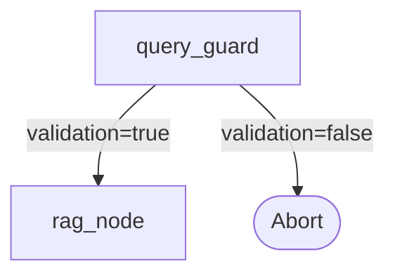
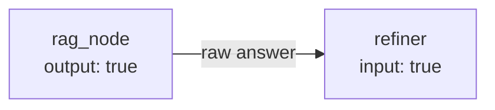

# Tutorial 4: RAG — Retrieval-Augmented Generation

Retrieval-Augmented Generation (RAG) lets a node answer questions from
external context rather than relying solely on the LLM's training data. In
KeGAL, retrieved content is a single string (`retrieved_chunks`) that the
compiler injects into any node whose prompt has `retrieved_chunks: true`.

---

## 1. Basic: direct assignment

The simplest approach is to assign the retrieved text in Python before
calling `compile()`.

```yaml
models:
  - llm: "ollama"
    model: "qwen2.5:7b"
    host: "http://localhost:11434"

prompts:
  - template:
      system_template:
        role: |
          You are a helpful assistant. Answer only from the context provided.
          If the context does not contain enough information, say so clearly.
      prompt_template:
        context: |
          Context:
          {retrieved_chunks}
        question: |
          {user_message}

nodes:
  - id: "rag_node"
    model: 0
    temperature: 0.2
    max_tokens: 512
    show: true
    prompt:
      template: 0
      user_message: true
      retrieved_chunks: true   # enables {retrieved_chunks} injection

edges:
  - node: "rag_node"
```

```python
from kegal import Compiler

def retrieve(query: str) -> str:
    # your retrieval logic: vector search, BM25, database lookup, etc.
    return "... relevant document chunks ..."

with Compiler(uri="rag.yml") as compiler:
    question = "What is the return policy?"
    compiler.retrieved_chunks = retrieve(question)
    compiler.user_message = question
    compiler.compile()

    for node in compiler.get_outputs().nodes:
        for msg in node.response.messages or []:
            print(msg)
```

> **Static context in YAML:** you can also declare `retrieved_chunks` directly
> in the graph YAML for content that never changes:
>
> ```yaml
> retrieved_chunks: |
>   Return policy: items may be returned within 30 days of purchase.
>   Refunds are processed within 5–7 business days.
> ```

---

## 2. Intermediate: loading from a file or URL

`add_retrieved_chunks` is a convenience helper that accepts a local file path,
a remote `https://` URL, or a plain string — exactly one source per call.
This is useful when chunks are prepared by a separate process and written
to disk, or served from a remote endpoint.

```python
from pathlib import Path
from kegal import Compiler

with Compiler(uri="rag.yml") as compiler:
    # from a local text file
    compiler.add_retrieved_chunks(file=Path("context/retrieved.txt"))
    compiler.user_message = "What is the return policy?"
    compiler.compile()
```

```python
with Compiler(uri="rag.yml") as compiler:
    # from a remote URL (https only)
    compiler.add_retrieved_chunks(
        uri="https://knowledge-base.example.com/api/chunks?q=return+policy"
    )
    compiler.user_message = "What is the return policy?"
    compiler.compile()
```

```python
with Compiler(uri="rag.yml") as compiler:
    # from an already-retrieved string (same as direct assignment)
    chunks = retrieve(user_question)
    compiler.add_retrieved_chunks(chunks=chunks)
    compiler.user_message = user_question
    compiler.compile()
```

Passing more than one source argument, or none at all, raises `ValueError`.

---

## 3. Intermediate: RAG + structured extraction

Combine RAG with `structured_output` to extract typed information from
retrieved documents rather than generating free-form text.

```yaml
models:
  - llm: "ollama"
    model: "qwen2.5:7b"
    host: "http://localhost:11434"

prompts:
  - template:
      system_template:
        role: |
          You are a data extraction specialist.
          Extract the requested fields from the context.
          Return only the JSON object — no prose.
      prompt_template:
        context: |
          {retrieved_chunks}
        instruction: |
          From the context above, extract the product specifications.

nodes:
  - id: "spec_extractor"
    model: 0
    temperature: 0.0
    max_tokens: 256
    show: true
    prompt:
      template: 0
      retrieved_chunks: true
    structured_output:
      description: "Product specification extraction"
      parameters:
        product_name:
          type: "string"
        price_usd:
          type: "number"
        warranty_years:
          type: "integer"
        features:
          type: "array"
          items: { type: "string" }
      required: ["product_name", "price_usd"]

edges:
  - node: "spec_extractor"
```

```python
with Compiler(uri="rag_extract.yml") as compiler:
    compiler.add_retrieved_chunks(file=Path("product_sheet.txt"))
    compiler.compile()

    data = compiler.get_outputs().nodes[0].response.json_output
    print(data["product_name"])   # "UltraWidget X200"
    print(data["price_usd"])      # 299.99
```

---

## 4. Advanced: guard → RAG pipeline

Validate the user query before performing retrieval. The guard runs first;
if the query is irrelevant, the RAG node never executes and no retrieval is
needed.



```yaml
prompts:
  # 0 — guard
  - template:
      system_template:
        role: |
          Determine whether the question can be answered from a
          software product knowledge base. Approve only technical
          questions about the product.
      prompt_template:
        query: "{user_message}"

  # 1 — RAG answer
  - template:
      system_template:
        role: |
          Answer the question using only the context below.
      prompt_template:
        context: "{retrieved_chunks}"
        question: "{user_message}"

nodes:
  - id: "query_guard"
    model: 0
    temperature: 0.0
    max_tokens: 128
    show: false
    prompt:
      template: 0
      user_message: true
    structured_output:
      description: "Query relevance check"
      parameters:
        validation:
          type: "boolean"
      required: ["validation"]

  - id: "rag_node"
    model: 0
    temperature: 0.2
    max_tokens: 512
    show: true
    prompt:
      template: 1
      user_message: true
      retrieved_chunks: true

edges:
  - node: "query_guard"
  - node: "rag_node"
```

```python
with Compiler(uri="guarded_rag.yml") as compiler:
    query = "How do I reset my password?"
    compiler.user_message = query
    compiler.retrieved_chunks = retrieve(query)  # retrieve before compiling
    compiler.compile()

    executed = {n.node_id for n in compiler.get_outputs().nodes}
    if "rag_node" not in executed:
        print("Query rejected by guard — not a product question.")
```

---

## 5. Advanced: multi-node RAG pipeline

Use message passing to chain a RAG node (raw answer) into a refinement node
(polished answer). Each node focuses on one task.



```yaml
prompts:
  # 0 — RAG: produce a raw, fact-dense answer
  - template:
      system_template:
        role: |
          Answer the question from the context. Be exhaustive — include
          all relevant details even if the answer is long.
      prompt_template:
        context: "{retrieved_chunks}"
        question: "{user_message}"

  # 1 — refiner: polish the raw answer into a concise response
  - template:
      system_template:
        role: |
          You receive a detailed but possibly verbose answer.
          Rewrite it as a clear, concise response suitable for a
          customer-facing chatbot. Max 3 sentences.
      prompt_template:
        raw: "{message_passing}"

nodes:
  - id: "rag_node"
    model: 0
    temperature: 0.1
    max_tokens: 1024
    show: false
    message_passing:
      output: true
    prompt:
      template: 0
      user_message: true
      retrieved_chunks: true

  - id: "refiner"
    model: 0
    temperature: 0.4
    max_tokens: 256
    show: true
    message_passing:
      input: true
    prompt:
      template: 1

edges:
  - node: "rag_node"
  - node: "refiner"
```

---

## Key points

- `retrieved_chunks` is a **single string** — chunk separation, ordering, and
  truncation are entirely the caller's responsibility.
- Set `prompt.retrieved_chunks: true` on every node that needs the content;
  nodes without this flag do not receive it.
- `add_retrieved_chunks` accepts exactly one of `file`, `uri`, or `chunks`.
  Only `https://` URLs are permitted for remote sources.
- The same `retrieved_chunks` value is shared by all nodes in the graph.
  If different nodes need different context, encode both in the single string
  or use message passing to pass context explicitly.
- Retrieval should happen **before** `compile()` — KeGAL does not perform
  retrieval internally.

---

> **Related tutorials:**
> [03 Guard nodes](03_guard_nodes.md) — validating queries before retrieval  
> [02 Structured output](02_structured_output.md) — extracting typed data from retrieved context  
> [01 Message passing](01_message_passing.md) — chaining a RAG node to a refinement step
