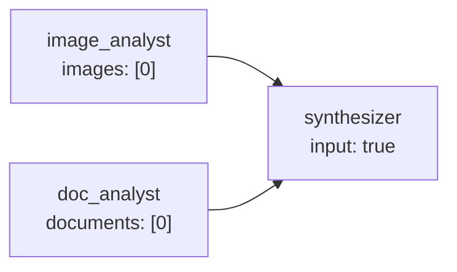

# Tutorial 7: Multimodal — Images and PDFs

KeGAL nodes can receive images and PDF documents alongside the text prompt.
The media is attached to the LLM call directly — no special placeholder is
needed in the prompt template. Nodes with vision or document understanding
capabilities will process the attached media as part of the message.

---

## 1. Basic: a single image

Declare an image at the graph level and reference it by index on the node.

```yaml
models:
  - llm: "ollama"
    model: "qwen2.5-vl:7b"    # a vision-capable model
    host: "http://localhost:11434"

images:
  - uri: "./assets/architecture_diagram.png"   # local file

prompts:
  - template:
      system_template:
        role: |
          You are a technical architect. Analyse the attached diagram.
      prompt_template:
        task: |
          {user_message}

nodes:
  - id: "diagram_analyst"
    model: 0
    temperature: 0.3
    max_tokens: 512
    show: true
    images: [0]     # index 0 from the images list
    prompt:
      template: 0
      user_message: true

edges:
  - node: "diagram_analyst"
```

```python
from kegal import Compiler

with Compiler(uri="vision.yml") as compiler:
    compiler.user_message = "Identify any bottlenecks visible in the diagram."
    compiler.compile()

    for msg in compiler.get_outputs().nodes[0].response.messages:
        print(msg)
```

> **Remote images:** use an `https://` URI. Only HTTPS is allowed for remote
> sources — `http://` raises `ValueError` before any network call is made.
>
> ```yaml
> images:
>   - uri: "https://example.com/chart.jpg"
> ```

---

## 2. Intermediate: PDF documents

Documents (PDFs) work the same way as images but are declared under
`documents:`.

```yaml
models:
  - llm: "anthropic"
    model: "claude-sonnet-4-6"
    api_key: "sk-ant-..."

documents:
  - uri: "./reports/q3_report.pdf"

prompts:
  - template:
      system_template:
        role: |
          You are a financial analyst. Answer questions about the
          attached earnings report.
      prompt_template:
        question: |
          {user_message}

nodes:
  - id: "report_analyst"
    model: 0
    temperature: 0.2
    max_tokens: 1024
    show: true
    documents: [0]    # index 0 from the documents list
    prompt:
      template: 0
      user_message: true

edges:
  - node: "report_analyst"
```

```python
with Compiler(uri="document_qa.yml") as compiler:
    compiler.user_message = "What was the operating margin in Q3?"
    compiler.compile()
```

---

## 3. Intermediate: multiple images and documents on one node

A node can receive multiple images, multiple documents, or a combination.
List the indices of every item you want to include.

```yaml
images:
  - uri: "./assets/floor_plan.png"       # index 0
  - uri: "./assets/elevation_view.png"   # index 1

documents:
  - uri: "./specs/building_specs.pdf"    # index 0

nodes:
  - id: "architect_review"
    model: 0
    temperature: 0.3
    max_tokens: 1024
    show: true
    images: [0, 1]      # both images
    documents: [0]       # the PDF
    prompt:
      template: 0
      user_message: true
```

Different nodes in the same graph can receive different subsets of the
declared media:

```yaml
nodes:
  - id: "floor_plan_analyst"
    images: [0]          # only the floor plan

  - id: "elevation_analyst"
    images: [1]          # only the elevation view

  - id: "spec_reader"
    documents: [0]       # only the PDF
```

---

## 4. Advanced: base64-encoded media

When media is not stored on disk or at a URL — for example, a screenshot
captured at runtime — encode it as base64 and pass it directly:

```yaml
images:
  - base64: "iVBORw0KGgoAAAANSUhEUgAA..."   # base64-encoded PNG
```

Or inject it in Python, replacing an image slot at runtime:

```python
import base64
from pathlib import Path
from kegal import Compiler
from kegal.graph import GraphInputData

raw_bytes = Path("screenshot.png").read_bytes()
b64 = base64.b64encode(raw_bytes).decode()

with Compiler(uri="vision.yml") as compiler:
    # replace all images with the runtime screenshot
    compiler.images = [GraphInputData(base64=b64)]
    compiler.user_message = "Describe what you see in this screenshot."
    compiler.compile()
```

> `compiler.images` and `compiler.documents` are lists of `GraphInputData`.
> Assigning to them replaces the list loaded from the YAML graph. The indices
> used by nodes still refer to positions in whichever list is active at
> `compile()` time.

---

## 5. Advanced: parallel multi-modal analysis

Fan out to multiple specialist nodes, each receiving different media, and
fan in to a synthesiser.



```yaml
models:
  - llm: "ollama"
    model: "qwen2.5-vl:7b"
    host: "http://localhost:11434"

images:
  - uri: "./assets/product_photo.jpg"

documents:
  - uri: "./specs/product_spec.pdf"

prompts:
  - template:  # 0 — image analyst
      system_template:
        role: Describe the product shown in the image. Focus on appearance and visible features.
      prompt_template:
        task: "{user_message}"

  - template:  # 1 — doc analyst
      system_template:
        role: Summarise the key technical specifications from the attached document.
      prompt_template:
        task: "{user_message}"

  - template:  # 2 — synthesizer
      system_template:
        role: |
          You receive a visual description and a technical specification.
          Combine them into a single product description for a customer.
      prompt_template:
        findings: "{message_passing}"

nodes:
  - id: "image_analyst"
    model: 0
    temperature: 0.3
    max_tokens: 512
    show: false
    images: [0]
    message_passing: { output: true }
    prompt: { template: 0, user_message: true }

  - id: "doc_analyst"
    model: 0
    temperature: 0.2
    max_tokens: 512
    show: false
    documents: [0]
    message_passing: { output: true }
    prompt: { template: 1, user_message: true }

  - id: "synthesizer"
    model: 0
    temperature: 0.5
    max_tokens: 512
    show: true
    message_passing: { input: true }
    prompt: { template: 2 }

edges:
  - node: "synthesizer"
    fan_in:
      - node: "image_analyst"
      - node: "doc_analyst"
```

```python
with Compiler(uri="multimodal_pipeline.yml") as compiler:
    compiler.user_message = "Prepare a product listing."
    compiler.compile()
```

---

## Key points

- Images and documents are declared at the graph level and referenced by
  **index** on each node.
- A node can reference multiple items from each list: `images: [0, 1, 2]`.
- Different nodes can receive different subsets of the same graph-level lists.
- Only `https://` URIs are permitted for remote media; `http://` raises
  `ValueError`.
- `base64` and `uri` are alternatives within a single `GraphInputData` entry —
  don't combine them.
- Media is attached to the LLM call directly — no `{placeholder}` is needed
  in the prompt template.
- At runtime, replacing `compiler.images` or `compiler.documents` before
  `compile()` overrides the YAML declarations.

---

> **Related tutorials:**
> [11 Multi-provider graphs](11_multi_provider.md) — choosing a vision-capable provider  
> [04 Fan-out and fan-in](04_fan_out_fan_in.md) — parallel specialist nodes
