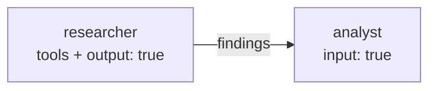

# Tutorial 8: Python Tool Executors

Tool executors let a node call Python functions during its LLM conversation.
When the model decides to use a tool, KeGAL calls the corresponding Python
function, returns the result to the model, and continues the conversation.
This loop repeats until the model produces a final text response — no extra
code is required in the caller.

---

## 1. Basic: a single tool

Define the tool in YAML and wire up a Python function via `tool_executors`.

### Step 1 — Declare the tool in YAML

```yaml
models:
  - llm: "ollama"
    model: "qwen2.5:7b"
    host: "http://localhost:11434"

tools:
  - name: "get_weather"
    description: "Returns the current weather for a given city."
    parameters:
      city:
        type: "string"
        description: "The city name."
    required: ["city"]

prompts:
  - template:
      system_template:
        role: |
          You are a weather assistant. Use the get_weather tool to
          answer weather questions.
      prompt_template:
        question: "{user_message}"

nodes:
  - id: "weather_node"
    model: 0
    temperature: 0.0
    max_tokens: 256
    show: true
    tools: ["get_weather"]    # reference by tool name
    prompt:
      template: 0
      user_message: true

edges:
  - node: "weather_node"
```

### Step 2 — Implement the executor

```python
def get_weather(city: str) -> str:
    # Call your actual weather API here
    return f"The weather in {city} is sunny, 22°C."
```

### Step 3 — Pass it to the compiler

```python
from kegal import Compiler

with Compiler(
    uri="weather.yml",
    tool_executors={"get_weather": get_weather},
) as compiler:
    compiler.user_message = "What's the weather in Rome?"
    compiler.compile()

    for msg in compiler.get_outputs().nodes[0].response.messages:
        print(msg)
```

> The tool name in `tool_executors` must exactly match `name` in the YAML
> `tools:` list. The function signature parameters must match the schema.

---

## 2. Intermediate: multiple tools

A node can have access to several tools. The model chooses which ones to
call, and may call them multiple times in any order.

```yaml
tools:
  - name: "search_kb"
    description: "Search the knowledge base for relevant documents."
    parameters:
      query:
        type: "string"
        description: "The search query."
    required: ["query"]

  - name: "get_product_price"
    description: "Return the current price of a product by SKU."
    parameters:
      sku:
        type: "string"
        description: "Product SKU code."
    required: ["sku"]

  - name: "check_availability"
    description: "Check whether a product is in stock."
    parameters:
      sku:
        type: "string"
      warehouse:
        type: "string"
        description: "Warehouse code (e.g. 'EU', 'US')."
    required: ["sku", "warehouse"]

nodes:
  - id: "sales_agent"
    model: 0
    temperature: 0.2
    max_tokens: 512
    show: true
    tools: ["search_kb", "get_product_price", "check_availability"]
    prompt:
      template: 0
      user_message: true
```

```python
def search_kb(query: str) -> str:
    results = knowledge_base.search(query)
    return "\n".join(r["text"] for r in results[:3])

def get_product_price(sku: str) -> str:
    price = product_db.get_price(sku)
    return f"${price:.2f}"

def check_availability(sku: str, warehouse: str) -> str:
    qty = inventory.get(sku, warehouse)
    return f"{qty} units available" if qty > 0 else "Out of stock"

with Compiler(
    uri="sales_agent.yml",
    tool_executors={
        "search_kb": search_kb,
        "get_product_price": get_product_price,
        "check_availability": check_availability,
    },
) as compiler:
    compiler.user_message = (
        "Is SKU-4821 available in the EU warehouse, and what does it cost?"
    )
    compiler.compile()
```

---

## 3. Intermediate: tool results in the output

The compiler records every tool call and its result in
`node.response.tool_results`. Inspect them for debugging or logging.

```python
with Compiler(uri="agent.yml", tool_executors=executors) as compiler:
    compiler.user_message = "..."
    compiler.compile()

    node = compiler.get_outputs().nodes[0]
    # Final text response from the model
    for msg in node.response.messages or []:
        print("Response:", msg)
    # Tool calls and results
    for tr in node.response.tool_results or []:
        print(f"Tool: {tr['name']}({tr['input']}) → {tr['result']}")
```

---

## 4. Advanced: tool + structured output

Combine tool-calling with `structured_output` so the model produces a typed
response after using its tools.

```yaml
tools:
  - name: "search_kb"
    description: "Search the knowledge base."
    parameters:
      query: { type: "string" }
    required: ["query"]

nodes:
  - id: "research_extractor"
    model: 0
    temperature: 0.0
    max_tokens: 512
    show: true
    tools: ["search_kb"]
    prompt:
      template: 0
      user_message: true
    structured_output:
      description: "Structured research findings"
      parameters:
        answer:
          type: "string"
          description: "The direct answer to the question."
        sources_used:
          type: "integer"
          description: "Number of knowledge base documents consulted."
        confidence:
          type: "string"
          enum: ["high", "medium", "low"]
      required: ["answer", "sources_used", "confidence"]
```

```python
with Compiler(uri="research.yml", tool_executors={"search_kb": search_kb}) as compiler:
    compiler.user_message = "What are the main causes of supply chain disruption?"
    compiler.compile()

    data = compiler.get_outputs().nodes[0].response.json_output
    print(data["answer"])
    print(f"Confidence: {data['confidence']} ({data['sources_used']} sources)")
```

---

## 5. Advanced: tool + message passing pipeline

A tool-calling node passes its result to a downstream node for further
processing. The tool calls happen inside the first node; only the final
text response is forwarded.



```yaml
nodes:
  - id: "researcher"
    model: 0
    temperature: 0.1
    max_tokens: 512
    show: false
    tools: ["search_kb", "get_document"]
    message_passing:
      output: true     # final response is forwarded downstream
    prompt:
      template: 0
      user_message: true

  - id: "analyst"
    model: 0
    temperature: 0.5
    max_tokens: 512
    show: true
    message_passing:
      input: true
    prompt:
      template: 1      # uses {message_passing} — receives researcher's findings
```

---

## 6. Advanced: node-level tool scoping

Different nodes in the same graph can access different subsets of the
declared tools. A node only sees the tools listed in its own `tools:` field.

```yaml
tools:
  - name: "sql_query"   ...
  - name: "web_search"  ...
  - name: "send_email"  ...

nodes:
  - id: "data_agent"
    tools: ["sql_query"]          # database access only

  - id: "research_agent"
    tools: ["web_search"]         # web search only

  - id: "comms_agent"
    tools: ["web_search", "send_email"]   # search + email
```

This scoping is enforced at the YAML level — if a tool name is not in the
top-level `tools:` list, `_validate_indices()` raises `ValueError` at
`Compiler` construction time.

---

## Key points

- Tool names in `tool_executors` must exactly match names in the YAML `tools:` list.
- The tool loop runs entirely inside the node — the caller never handles
  individual tool calls.
- A node may call tools multiple times per `compile()`. All calls are
  recorded in `node.response.tool_results`.
- Each node only sees the tools declared in its own `tools:` list.
- Tool executors must be thread-safe if parallel nodes share the same function.
- Combine with `structured_output` to get a typed final response after the
  tool loop completes.

---

> **Related tutorials:**
> [09 MCP servers](09_mcp_servers.md) — out-of-process tools via the Model Context Protocol  
> [12 ReAct loop](12_react_loop.md) — tools inside ReAct agent nodes  
> [01 Message passing](01_message_passing.md) — forwarding tool results downstream
