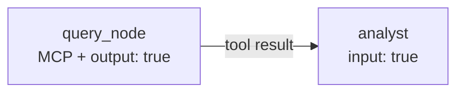

# Tutorial 9: MCP Servers

The [Model Context Protocol](https://modelcontextprotocol.io) (MCP) lets a
node call tools that live in a **separate process** rather than as in-process
Python functions. KeGAL supports `stdio` (subprocess) and `sse` (HTTP/SSE)
transports. MCP servers are started automatically at `Compiler` construction
and shut down cleanly on `close()`.

---

## 1. Basic: stdio server

### Step 1 — Write the server

Any MCP-compatible server works. A minimal example using
[`fastmcp`](https://github.com/jlowin/fastmcp):

```python
# my_server.py
from mcp.server.fastmcp import FastMCP

mcp = FastMCP("my-tools")

@mcp.tool()
def greet(name: str) -> str:
    """Return a greeting for the given name."""
    return f"Hello, {name}!"

@mcp.tool()
def add(a: int, b: int) -> int:
    """Add two integers."""
    return a + b

if __name__ == "__main__":
    mcp.run(transport="stdio")
```

### Step 2 — Configure the graph

```yaml
models:
  - llm: "ollama"
    model: "qwen2.5:7b"
    host: "http://localhost:11434"

mcp_servers:
  - id: "my_tools"        # arbitrary identifier
    transport: "stdio"
    command: "python"
    args: ["my_server.py"]

prompts:
  - template:
      system_template:
        role: |
          You are a helpful assistant. Use the available tools to answer.
      prompt_template:
        question: "{user_message}"

nodes:
  - id: "tool_node"
    model: 0
    temperature: 0.0
    max_tokens: 256
    show: true
    mcp_servers: ["my_tools"]    # reference by server id
    prompt:
      template: 0
      user_message: true

edges:
  - node: "tool_node"
```

### Step 3 — Run

```python
from kegal import Compiler

with Compiler(uri="mcp_graph.yml") as compiler:
    compiler.user_message = "What is the greeting for Alice, and what is 7 + 5?"
    compiler.compile()

    for msg in compiler.get_outputs().nodes[0].response.messages:
        print(msg)
```

The `with` statement ensures the MCP subprocess is terminated when done.

---

## 2. Intermediate: SSE transport

For a remote MCP server (e.g. a running HTTP service), use `sse` transport
and provide a `url` instead of `command`/`args`:

```yaml
mcp_servers:
  - id: "remote_tools"
    transport: "sse"
    url: "http://my-tools-service:8080/sse"
```

No `command` or `args` are needed — the compiler connects to the running
service at construction time.

---

## 3. Intermediate: multiple servers on one node

A node can access tools from multiple MCP servers simultaneously:

```yaml
mcp_servers:
  - id: "db_server"
    transport: "stdio"
    command: "python"
    args: ["db_server.py"]

  - id: "web_server"
    transport: "stdio"
    command: "python"
    args: ["web_server.py"]

nodes:
  - id: "research_node"
    model: 0
    temperature: 0.2
    max_tokens: 512
    show: true
    mcp_servers: ["db_server", "web_server"]   # tools from both servers
    prompt:
      template: 0
      user_message: true
```

Different nodes can access different server subsets:

```yaml
nodes:
  - id: "db_agent"
    mcp_servers: ["db_server"]       # database only

  - id: "web_agent"
    mcp_servers: ["web_server"]      # web only

  - id: "full_agent"
    mcp_servers: ["db_server", "web_server"]   # both
```

---

## 4. Intermediate: chaining MCP output

A common pattern is to have one node query a tool and pass its output to a
second node for analysis. The MCP tool loop runs entirely inside the first
node — only the final text response is forwarded via message passing.



```yaml
models:
  - llm: "ollama"
    model: "qwen2.5:7b"
    host: "http://localhost:11434"

mcp_servers:
  - id: "sqlite"
    transport: "stdio"
    command: "python"
    args: ["sqlite_server.py", "--db", "data.db"]

prompts:
  - template:  # 0 — query node
      system_template:
        role: |
          You have access to a SQLite database. Use the query tool to
          retrieve the requested data. Summarise the result concisely.
      prompt_template:
        request: "{user_message}"

  - template:  # 1 — analyst
      system_template:
        role: |
          You receive a database query result. Interpret it and provide
          actionable insights.
      prompt_template:
        data: "{message_passing}"

nodes:
  - id: "query_node"
    model: 0
    temperature: 0.0
    max_tokens: 512
    show: false
    mcp_servers: ["sqlite"]
    message_passing: { output: true }
    prompt: { template: 0, user_message: true }

  - id: "analyst"
    model: 0
    temperature: 0.5
    max_tokens: 512
    show: true
    message_passing: { input: true }
    prompt: { template: 1 }

edges:
  - node: "query_node"
  - node: "analyst"
```

```python
with Compiler(uri="mcp_chain.yml") as compiler:
    compiler.user_message = "Show me total sales by product category for Q3."
    compiler.compile()
```

---

## 5. Advanced: MCP server inside a ReAct agent

In a ReAct graph, MCP servers must be attached to **agent** nodes, not the
controller. The controller dispatches to agents; agents call the MCP tools.

```yaml
mcp_servers:
  - id: "sqlite"
    transport: "stdio"
    command: "python"
    args: ["sqlite_server.py"]

nodes:
  - id: "controller"
    model: 0
    temperature: 0.0
    max_tokens: 512
    show: true
    prompt:
      template: 0
      user_message: true
    react:
      max_iterations: 6
    react_output:
      type: object
      properties:
        next_agent:   { type: string }
        agent_input:  { type: string }
        done:         { type: boolean }
        final_answer: { type: string }
        reasoning:    { type: string }
      required: [done]

  - id: "db_agent"
    model: 0
    temperature: 0.0
    max_tokens: 512
    show: false               # react agents: show=true is ignored — use message_passing.output
    mcp_servers: ["sqlite"]          # ← MCP on the agent, not the controller
    message_passing: { input: true, output: true }
    prompt: { template: 1 }

edges:
  - node: "controller"
    react:
      - node: "db_agent"
```

The MCP tool loop runs inside `db_agent`'s isolated execution context — tool
calls are made, results are injected into the agent's conversation, and only
the final answer is returned to the controller as an observation.

See [Tutorial 12: ReAct loop](12_react_loop.md) for the full ReAct pattern.

---

## 6. Advanced: combining MCP with Python tool executors

A node can have both `mcp_servers` and in-process `tools` at the same time.
The model sees all available tools from both sources and can call any of them.

```yaml
tools:
  - name: "format_currency"
    description: "Format a number as a currency string."
    parameters:
      amount: { type: "number" }
      currency: { type: "string" }
    required: ["amount", "currency"]

mcp_servers:
  - id: "exchange_rates"
    transport: "stdio"
    command: "python"
    args: ["exchange_server.py"]

nodes:
  - id: "fx_node"
    model: 0
    temperature: 0.0
    max_tokens: 256
    show: true
    tools: ["format_currency"]           # in-process Python function
    mcp_servers: ["exchange_rates"]      # out-of-process MCP server
    prompt:
      template: 0
      user_message: true
```

```python
def format_currency(amount: float, currency: str) -> str:
    symbols = {"USD": "$", "EUR": "€", "GBP": "£"}
    sym = symbols.get(currency, currency)
    return f"{sym}{amount:,.2f}"

with Compiler(
    uri="fx.yml",
    tool_executors={"format_currency": format_currency},
) as compiler:
    compiler.user_message = "What is €500 in USD, formatted?"
    compiler.compile()
```

---

## 7. Intermediate: filtering tools per node

By default, a node sees **all** tools from every MCP server assigned to it.
When a server exposes many tools but a node only needs a few, you can whitelist
the tools it is allowed to call. The LLM never sees the hidden tools.

Use the object form of `mcp_servers` with an optional `tools` list:

```yaml
mcp_servers:
  - id: "file_tools"
    transport: "stdio"
    command: "python"
    args: ["file_server.py"]   # exposes: list_directory, read_text_file,
                               #          read_pdf_file, write_text_file

nodes:
  # reader — can only read text files
  - id: "reader"
    model: 0
    temperature: 0.0
    max_tokens: 2000
    show: true
    mcp_servers:
      - id: file_tools
        tools: [read_text_file]
    prompt: { template: 0 }

  # writer — can read and write, but not list or read PDFs
  - id: "writer"
    model: 0
    temperature: 0.0
    max_tokens: 4000
    show: true
    mcp_servers:
      - id: file_tools
        tools: [read_text_file, write_text_file]
    prompt: { template: 1 }
```

The shorthand string form (`mcp_servers: [file_tools]`) remains valid and exposes
all tools — it is automatically converted to `{id: file_tools, tools: null}` internally.
Both forms can be mixed in the same list if a node uses multiple servers:

```yaml
mcp_servers:
  - id: file_tools
    tools: [read_text_file, write_text_file]   # filtered
  - id: db_tools                               # all tools exposed (shorthand equivalent)
```

**Why filter?** Local LLMs can get confused when presented with many tools.
Hiding irrelevant tools reduces hallucinations and keeps the model focused on
the task at hand.

---

## 8. Intermediate: controlling the tool call loop limit

The tool loop inside each node calls the LLM repeatedly until it stops
generating tool calls or a limit is reached. The default limit is **10
iterations** (one iteration = one LLM call, which may produce several tool
calls).

For nodes that need to read many files or perform many sequential operations,
raise the limit with `max_tool_calls`:

```yaml
nodes:
  - id: "analyst"
    model: 0
    temperature: 0.1
    max_tokens: 8000
    show: true
    mcp_servers:
      - id: file_tools
        tools: [read_text_file, write_text_file]
    max_tool_calls: 25          # allow up to 25 LLM-call iterations
    prompt: { template: 0 }
```

`max_tool_calls` is a per-node setting — different nodes in the same graph can
have different limits. Nodes without `mcp_servers` or `tools` ignore it.

---

## Key points

- MCP servers are started at `Compiler` construction and stopped at `close()`.
  Always use `with Compiler(...) as compiler:` to ensure clean shutdown.
- `stdio` servers: `command` and `args` are required; `url` must be absent.
- `sse` servers: `url` is required; `command` and `args` must be absent.
- A node references servers by ID — the ID must appear in the top-level
  `mcp_servers:` list or `_validate_indices()` raises `ValueError`.
- Use the object form (`{id, tools}`) to whitelist which tools a node can call.
  The shorthand string form remains valid and exposes all tools.
- `max_tool_calls` controls how many LLM-call iterations the tool loop runs.
  Default is 10. Increase for nodes that read many files or call many tools.
- MCP servers must not be attached to ReAct controller nodes — only to agent nodes.
- Tool calls have a default timeout of 60 s per call; stalled tool calls
  raise `TimeoutError` rather than blocking indefinitely.

---

> **Related tutorials:**
> [08 Tool executors](08_tool_executors.md) — in-process Python tool functions  
> [12 ReAct loop](12_react_loop.md) — MCP inside iterative agent dispatch
