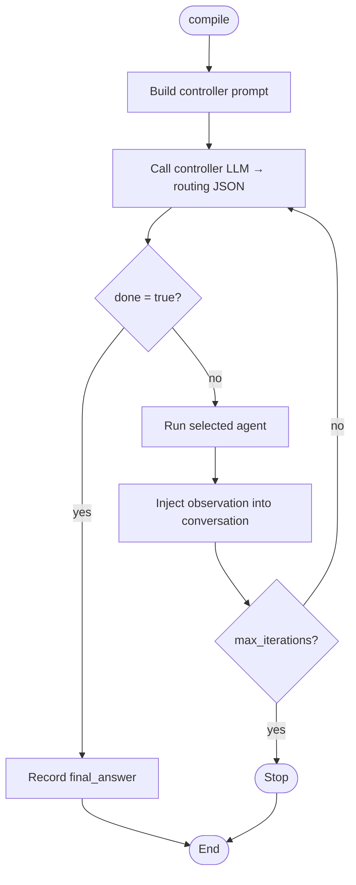
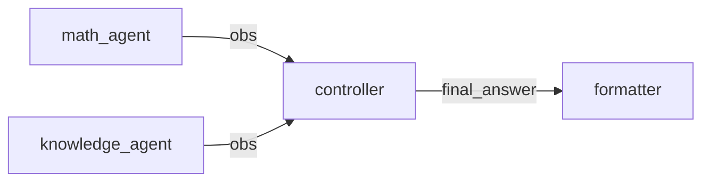
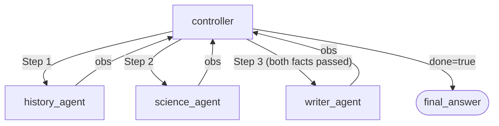

# Tutorial 12: ReAct Loop — Iterative Agent Dispatch

The ReAct (Reason + Act) pattern lets a **controller** node reason across
multiple turns, dispatching sub-tasks to **agent** nodes one at a time,
observing their outputs, and deciding what to do next. It is the right choice
when the number of steps needed to complete a task is not known in advance.

---

## 1. Basic: controller + two agents

### How it works



The controller LLM must return a JSON object (`react_output` schema) on every
call. Reserved fields: `next_agent`, `agent_input`, `done`, `final_answer`,
`reasoning`.

### Step 1 — Prompts

```yaml
prompts:
  # 0 — controller
  - template:
      system_template:
        role: |
          You are a task coordinator. Answer the user's question by
          dispatching sub-tasks to specialists one at a time.
          Available agents:
            - math_agent    : arithmetic and algebra
            - knowledge_agent : factual questions
          Return JSON with: next_agent, agent_input, done, final_answer, reasoning.
          Set done=true only when the full question is answered.
      prompt_template:
        task: "{user_message}"

  # 1 — math agent
  - template:
      system_template:
        role: You are a calculator. Answer in one sentence.
      prompt_template:
        question: "{message_passing}"

  # 2 — knowledge agent
  - template:
      system_template:
        role: You are a factual assistant. Answer in one sentence.
      prompt_template:
        question: "{message_passing}"
```

### Step 2 — Nodes

```yaml
nodes:
  - id: "controller"
    model: 0
    temperature: 0.0
    max_tokens: 512
    show: true
    prompt:
      template: 0
      user_message: true
    react:
      max_iterations: 8
    react_output:
      description: "Routing decision"
      parameters:
        next_agent:   { type: "string" }
        agent_input:  { type: "string" }
        done:         { type: "boolean" }
        final_answer: { type: "string" }
        reasoning:    { type: "string" }
      required: ["done"]

  - id: "math_agent"
    model: 0
    temperature: 0.0
    max_tokens: 64
    show: true
    message_passing: { input: true, output: true }
    prompt: { template: 1 }

  - id: "knowledge_agent"
    model: 0
    temperature: 0.0
    max_tokens: 64
    show: true
    message_passing: { input: true, output: true }
    prompt: { template: 2 }
```

### Step 3 — Edges

Agent nodes are declared in the controller's `react:` edge list. They are
**excluded from the main DAG** — they only run when the controller dispatches.

```yaml
edges:
  - node: "controller"
    react:
      - node: "math_agent"
      - node: "knowledge_agent"
```

### Step 4 — Run and inspect the trace

```python
from kegal import Compiler

with Compiler(uri="react_graph.yml") as compiler:
    compiler.user_message = "What is 14 × 6, and what is the capital of Japan?"
    compiler.compile()

    # Controller's final answer
    for node in compiler.get_outputs().nodes:
        if node.node_id == "controller":
            print("Answer:", node.response.json_output.get("final_answer"))

    # Detailed per-iteration trace
    trace = compiler.get_react_trace("controller")
    print(f"Iterations: {trace.total_iterations}")
    for it in trace.iterations:
        print(f"  [{it.iteration}] → {it.agent_name}: {it.agent_output[:80]}")
```

---

## 2. Intermediate: tools inside an agent

Agent nodes participate in the normal tool loop — the model may call tools
across multiple turns before returning its result to the controller.

> **Rule:** put tools and MCP on agent nodes, **never** on the controller.
> If the controller needs information, dispatch an agent that has the tool.

```yaml
tools:
  - name: "get_exchange_rate"
    description: "Returns the exchange rate between two currencies."
    parameters:
      from_currency: { type: "string" }
      to_currency:   { type: "string" }
    required: ["from_currency", "to_currency"]

nodes:
  - id: "controller"
    ...
    # no tools here

  - id: "fx_agent"
    model: 0
    temperature: 0.0
    max_tokens: 256
    message_passing: { input: true, output: true }
    prompt: { template: 1 }
    tools: ["get_exchange_rate"]   # ← tool on the agent

edges:
  - node: "controller"
    react:
      - node: "fx_agent"
```

```python
def get_exchange_rate(from_currency: str, to_currency: str) -> str:
    return f"1 {from_currency} = 1.08 {to_currency}"

with Compiler(
    uri="fx_react.yml",
    tool_executors={"get_exchange_rate": get_exchange_rate},
) as compiler:
    compiler.user_message = "How much is €500 in USD?"
    compiler.compile()
    trace = compiler.get_react_trace("controller")
    print(trace.final_answer)
```

---

## 3. Intermediate: MCP server inside an agent

MCP tools work the same way as in-process tools — attach them to the agent,
not the controller.

```yaml
mcp_servers:
  - id: "sqlite"
    transport: "stdio"
    command: "python"
    args: ["sqlite_server.py"]

nodes:
  - id: "db_agent"
    model: 0
    max_tokens: 512
    message_passing: { input: true, output: true }
    prompt: { template: 1 }
    mcp_servers: ["sqlite"]   # ← MCP on the agent
```

---

## 4. Intermediate: resume — automatic compaction

For long loops the conversation buffer can exceed the model's context window.
Set `resume: true` and KeGAL will compact the buffer automatically when it
approaches the limit.

```yaml
react:
  max_iterations: 20
  resume: true
  resume_threshold: 0.75    # compact at 75% of the context window
```

The `context_window` field on the model is used as the denominator. Without
it, `max_tokens` is used — a much smaller proxy. Always set `context_window`
when using `resume: true`.

```yaml
models:
  - llm: "ollama"
    model: "qwen2.5:7b"
    host: "http://localhost:11434"
    context_window: 32768
```

To use a custom compaction prompt instead of the built-in one:

```yaml
react_compact_prompts:
  - template:
      system_template:
        instruction: |
          Compress the conversation into a dense state record.
          Preserve ALL findings — do not summarise them away.
      prompt_template:
        action: Compact the conversation above now.
```

---

## 5. Advanced: piping the final answer downstream

A ReAct controller with `message_passing.output: true` writes its
`final_answer` to the shared pipe after the loop completes. A downstream
node with `message_passing.input: true` receives it automatically — no
`fan_in` is needed.



```yaml
nodes:
  - id: "controller"
    ...
    message_passing:
      output: true         # writes final_answer to the pipe after loop ends

  - id: "formatter"
    model: 0
    temperature: 0.0
    max_tokens: 128
    show: true
    message_passing:
      input: true          # receives the controller's final_answer
    prompt: { template: 3 }

edges:
  - node: "controller"
    react:
      - node: "math_agent"
      - node: "knowledge_agent"
  - node: "formatter"      # placed after controller in edges for clarity
```

---

## 6. Advanced: multi-agent synthesis pattern

A common pattern is to gather from multiple specialists before synthesising
with a writer agent. The controller accumulates observations, then passes
all findings to the writer in one dispatch.



```yaml
edges:
  - node: "controller"
    react:
      - node: "history_agent"
      - node: "science_agent"
      - node: "writer_agent"
```

The controller dispatches to `history_agent` and `science_agent` sequentially,
collecting facts; then dispatches to `writer_agent` with all facts in
`agent_input` to produce the final article.

---

## 7. Advanced: chat history seeding the controller

`chat_history` on the controller seeds its conversation buffer with prior
turns, giving the model context from previous sessions.

```yaml
chat_history:
  research_session:
    path: ./history/research.json
    auto: true    # append user+final_answer after each compile()

nodes:
  - id: "controller"
    ...
    prompt:
      template: 0
      user_message: true
      chat_history: "research_session"
```

See [Tutorial 5: Chat history](05_chat_history.md) for full details.

---

## 8. Controller vs agent feature support

| Feature | Controller | Agent nodes |
|---|---|---|
| `tools` | ✗ ignored — warning at init | ✓ full tool loop |
| `mcp_servers` | ✗ ignored — warning at init | ✓ full tool loop |
| `blackboard.read / .write` | ✗ ignored — warning at init | ✓ writes persist across iterations |
| `message_passing.input` | ✓ seeds initial conversation | ✓ receives `agent_input` |
| `message_passing.output` | ✓ pushes `final_answer` downstream | ✓ result observed by controller |
| `images / documents` | ✓ included in every controller call | ✓ standard |
| `chat_history` | ✓ seeds conversation buffer | ✓ standard |
| `user_message` | ✓ first turn in conversation | ✓ standard |

---

## Key points

- The controller LLM must return a `react_output` JSON on every iteration.
- Agent nodes are excluded from the main DAG and only run when dispatched.
- `react` and `children`/`fan_in` are mutually exclusive on the same edge entry.
- `max_iterations` caps the loop regardless of the `done` signal.
- `resume: true` requires `context_window` on the model for accurate compaction.
- Concurrent ReAct controllers at the same topological level are not supported
  and raise `ValueError`.

---

> **Related tutorials:**
> [08 Tool executors](08_tool_executors.md) — Python tools inside agent nodes  
> [09 MCP servers](09_mcp_servers.md) — out-of-process tools inside agent nodes  
> [05 Chat history](05_chat_history.md) — seeding the controller's conversation buffer  
> [13 Context window](13_context_window.md) — accurate compaction with context_window
