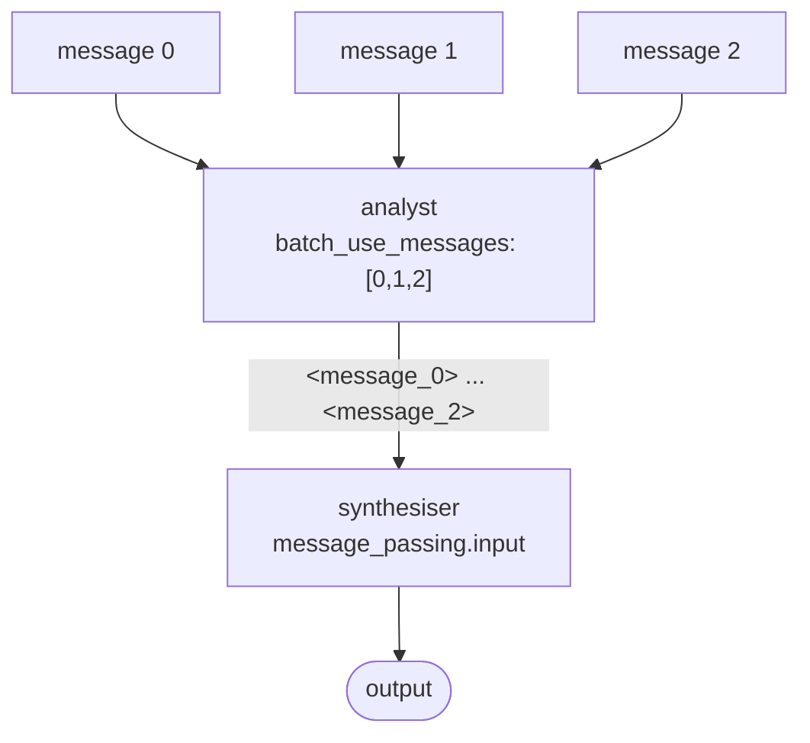
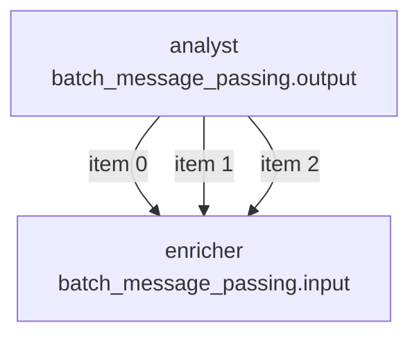
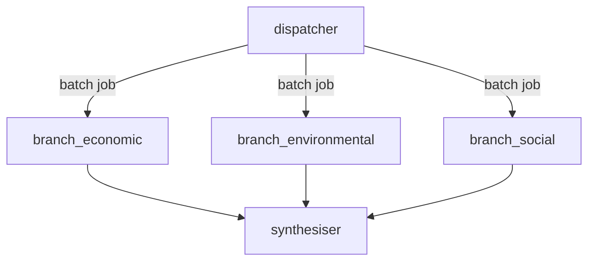

# Tutorial 14: Batch Inference

Batch inference submits multiple LLM calls as a single asynchronous job rather than making them one by one.
Most providers offer ~50% cost reduction for batch mode.
KeGAL exposes batch at two levels: **intra-node** (one node processes N user messages) and **inter-node**
(N separate nodes submitted as one job).

Both are activated from YAML alone. The Python API (`compiler.compile()`) is unchanged.

---

## 1. Level 1: one node, many messages

The simplest batch pattern sends N user messages through the same node in a single batch job,
then collects the N results for a downstream synthesiser.



### What changes in YAML

Replace `user_message` at the graph level with `batch_user_messages`. On the node that runs in batch,
set `prompt.batch_use_messages` to the list of indices to process. Use `message_passing.output: true`
to forward the tagged results downstream.

```yaml
batch_user_messages:
  - "Analyse the financial performance of company A."
  - "Analyse the financial performance of company B."
  - "Analyse the financial performance of company C."

models:
  - llm: "anthropic"
    model: "claude-haiku-4-5-20251001"
    api_key: "${ANTHROPIC_API_KEY}"

prompts:
  # 0 — analyst
  - template:
      system_template:
        role: |
          You are a financial analyst.
          Summarise this company's financial performance covering revenue, margin, and key risks.
      prompt_template:
        task: "{user_message}"

  # 1 — synthesiser
  - template:
      system_template:
        role: |
          You are a portfolio strategist.
          Given the individual summaries below, produce a comparative overview
          and a single investment recommendation.
      prompt_template:
        analyses: |
          {message_passing}

nodes:
  - id: "analyst"
    model: 0
    temperature: 0.3
    max_tokens: 512
    show: true
    prompt:
      template: 0
      batch_use_messages: [0, 1, 2]   # 3 calls → 1 batch job
    message_passing:
      output: true                     # tagged output forwarded to synthesiser

  - id: "synthesiser"
    model: 0
    temperature: 0.5
    max_tokens: 1024
    show: true
    message_passing:
      input: true                      # receives <message_0>, <message_1>, <message_2>
    prompt:
      template: 1

edges:
  - node: "analyst"
  - node: "synthesiser"
```

### What the synthesiser receives

The `{message_passing}` placeholder in the synthesiser's prompt is filled with:

```
<message_0>Company A summary …</message_0>
<message_1>Company B summary …</message_1>
<message_2>Company C summary …</message_2>
```

The synthesiser sees all three analyses in a single LLM call.

---

## 2. Level 1 with structured output

If the analyst produces structured JSON, each object is serialised with `json.dumps` inside its tag:

```
<message_0>{"revenue": "€120M", "margin": "18%", "risk": "regulatory"}</message_0>
<message_1>{"revenue": "€95M",  "margin": "22%", "risk": "supply chain"}</message_1>
<message_2>{"revenue": "€210M", "margin": "14%", "risk": "competition"}</message_2>
```

The downstream node receives valid JSON strings. Its prompt template can instruct the LLM to parse them.

---

## 3. Level 1 with per-item pass-through (`batch_message_passing`)

When you want the downstream node to be called once per batch item (instead of once with all items tagged),
use `batch_message_passing` instead of `message_passing` on both nodes:



```yaml
nodes:
  - id: "analyst"
    model: 0
    temperature: 0.3
    max_tokens: 512
    show: true
    prompt:
      template: 0
      batch_use_messages: [0, 1, 2]
    batch_message_passing:
      output: true     # each result passed individually downstream

  - id: "enricher"
    model: 0
    temperature: 0.3
    max_tokens: 512
    show: true
    batch_message_passing:
      input: true      # receives each item as a separate call
    prompt:
      template: 1
```

The enricher is called 3 times, once per analyst output. From the enricher's perspective each call looks
identical to a regular non-batch call.

---

## 4. Level 2: batch fan-out / fan-in

When you already have separate nodes (each with its own prompt) and want to submit them as a single batch
job, use `batch_children` and `batch_fan_in` on the edges. This is functionally identical to `children` /
`fan_in` but uses the provider's batch API.



```yaml
models:
  - llm: "anthropic"
    model: "claude-haiku-4-5-20251001"
    api_key: "${ANTHROPIC_API_KEY}"

prompts:
  - template:   # 0 — dispatcher
      system_template:
        role: Decompose the research question into three independent sub-questions.
      prompt_template:
        question: "{user_message}"

  - template:   # 1 — economic branch
      system_template:
        role: Analyse only the economic aspects of the topic.
      prompt_template:
        topic: "{message_passing}"

  - template:   # 2 — environmental branch
      system_template:
        role: Analyse only the environmental aspects of the topic.
      prompt_template:
        topic: "{message_passing}"

  - template:   # 3 — social branch
      system_template:
        role: Analyse only the social aspects of the topic.
      prompt_template:
        topic: "{message_passing}"

  - template:   # 4 — synthesiser
      system_template:
        role: Combine the three analyses into a single coherent report.
      prompt_template:
        analyses: "{message_passing}"

nodes:
  - id: "dispatcher"
    model: 0
    temperature: 0.2
    max_tokens: 256
    show: false
    prompt: { template: 0, user_message: true }
    message_passing: { output: true }

  - id: "branch_economic"
    model: 0
    temperature: 0.5
    max_tokens: 512
    show: true
    prompt: { template: 1 }
    message_passing: { input: true, output: true }

  - id: "branch_environmental"
    model: 0
    temperature: 0.5
    max_tokens: 512
    show: true
    prompt: { template: 2 }
    message_passing: { input: true, output: true }

  - id: "branch_social"
    model: 0
    temperature: 0.5
    max_tokens: 512
    show: true
    prompt: { template: 3 }
    message_passing: { input: true, output: true }

  - id: "synthesiser"
    model: 0
    temperature: 0.5
    max_tokens: 1024
    show: true
    prompt: { template: 4 }
    message_passing: { input: true }

edges:
  - node: "dispatcher"
    batch_children:          # one batch job for all three branches
      - node: "branch_economic"
      - node: "branch_environmental"
      - node: "branch_social"

  - node: "synthesiser"
    batch_fan_in:            # wait for all three batch results
      - node: "branch_economic"
      - node: "branch_environmental"
      - node: "branch_social"
```

All three branches are submitted in a single batch job. The synthesiser waits for all three before running.

---

## 5. Provider notes

| Provider | Activation | Extra config needed |
|---|---|---|
| `anthropic` | Automatic when batch mode is declared | None |
| `anthropic_aws` | Automatic | None |
| `openai` | Automatic | None |
| `gemini` | Automatic | None |
| `bedrock` | Automatic | `batch_role_arn`, `batch_s3_input_uri`, `batch_s3_output_uri` on the model |
| `ollama` | Thread pool fallback | None |

For the full provider reference and Bedrock S3 configuration details, see [Batch Inference Reference](../batch_doc.md).
